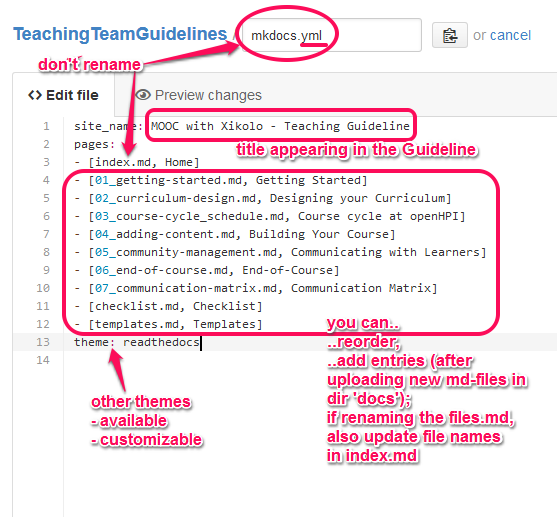

# TeachingTeamGuidelines

This GitHub repository contains Markdown files for providing an online documentation for the HPI MOOC platform ("Xikolo") with ReadTheDocs.

## General information

The documentation can be found here: http://teachingteamguidelines.readthedocs.org.

The following three tools are used to make the documentation available:

- **GitHub**

Used for hosting and editing the necessary files representing the documentations content (the Markdown files) and structure (`.yml` file).

- **MkDocs**

This is essentially a Python script, i.e. the technology used to build static HTML files as the output; it takes the Markdown files and a `.yml` configuration file as input.

- **ReadTheDocs**

A webservice using MkDocs as the backend for building the documentation out of Markdown files and hosting the HTML documentation site; it connects to GitHub to load the content (Markdown files) and their configuration (`mkdocs.yml` file).

## Updating the guidelines

### 1st step: Editing process

- Log in here on GitHub, make sure you have owner status for this repository, and
- **add/edit markdown file(s)** to update the content of the documentation.
- If you want to reorder chapters or add new md-files, edit the `mkdocs.yml` and adjust the order/filenames.
- *Also* adjust those changes inside the *index.md* file.
- Attention: **Never rename the `mkdocs.yml` or the `index.md` files**!
- You can also customize themes and build more complex document structures (follow the link to the manuals below).

### 2nd step: Building process

The documentation is automatically fetched from the `master` branch and will be updated via webhook.

If this does not work, there is also a manual process for building the documentation:

1. Log in at [ReadTheDocs](https://readthedocs.org).
2. **Create a new build**. ReadTheDocs will fetch the files from GitHub and update the documentation immediately. For more information about this process, look up the ReadTheDocs documentation (link below).

## More info ...

... about ReadTheDocs:

 - [ReadTheDocs Manual](http://read-the-docs.readthedocs.org/en/latest/)
 - [RTD GitHub Page](https://github.com/rtfd/readthedocs.org)
 
... about MKDocs:

 - [MkDocs Manual](http://www.mkdocs.org/)
 - ["Documenting your project with MkDocs"](https://ep2014.europython.eu/de/schedule/sessions/39/): Video by the developer Tom Christie

... about Markdown:

 - Syntax documentation on [Daring Fireball](http://daringfireball.net/projects/markdown/syntax)
 - [Editor MarkdownPad2](http://markdownpad.com/) (if you feel more comfortable with editing on your local system and syncing with GitHub afterwards)
 
 
