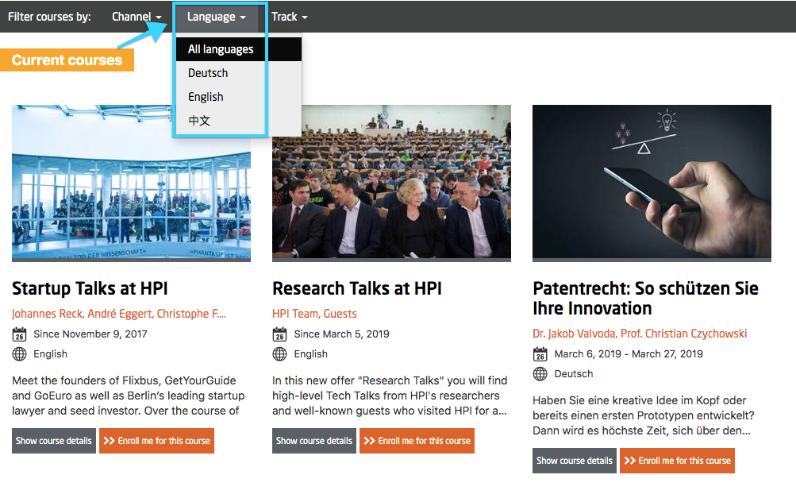
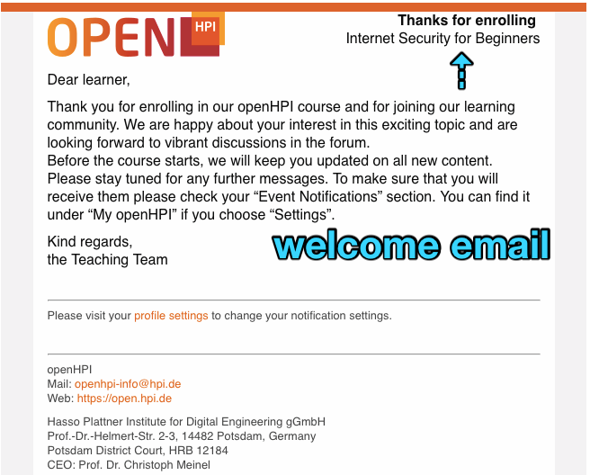
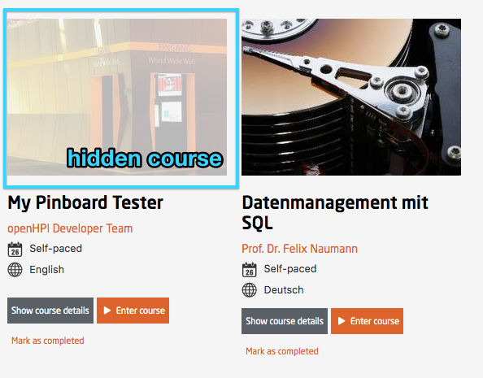
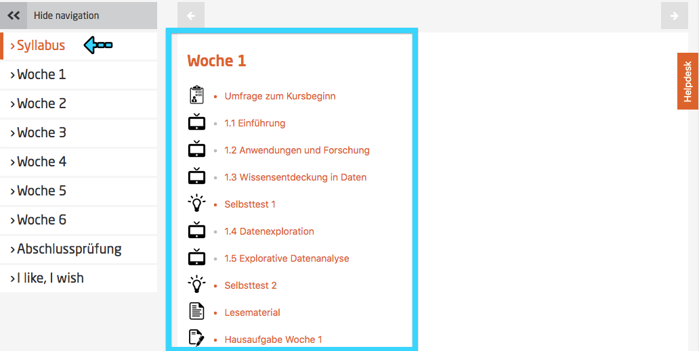
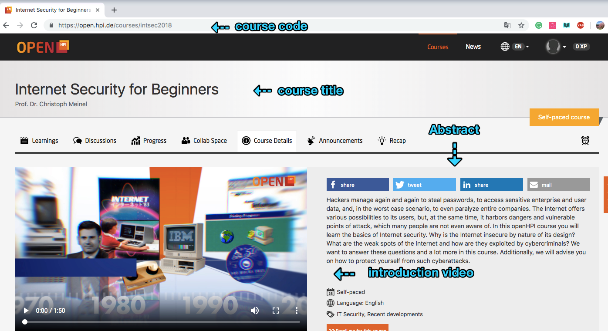
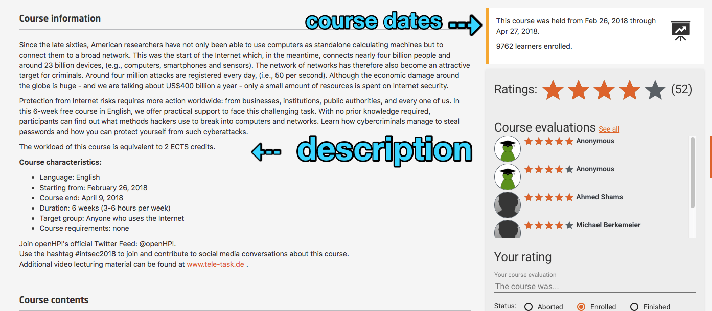
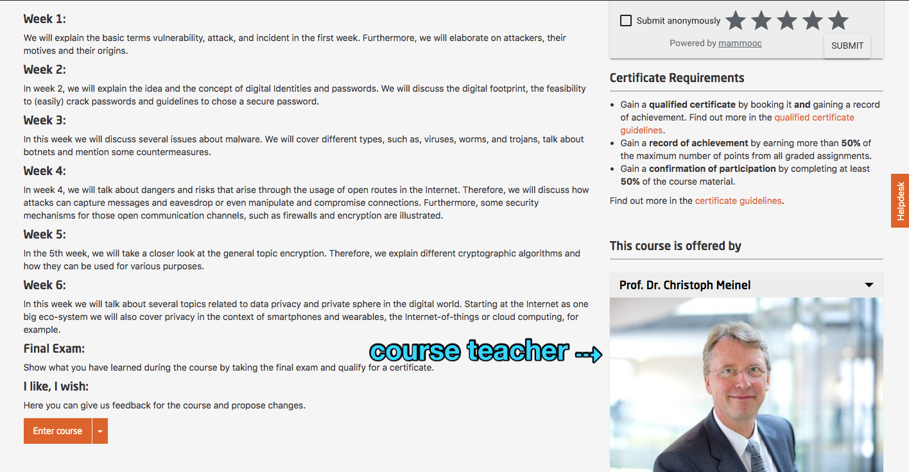

# Setting up the course's properties

The course itself will be generated by the platform ops team.

You will have to complete a few settings, however.

Platform admins or course admins can edit the course's properties under the course administration menu.  

*Fig. 01: Course Administration* => *Course properties*

## Course Title
You can change the course title anytime you want. You should, however, stick to the chosen title as soon as the course has been published or announced.

## Course Code
The course code will be visible to the participants in the course's URL.
Apart from that it only serves for internal purposes and should not be changed anymore later on as some features, such as the automatic filtering of the course videos for the video item dropdown relies on it.

## Abstract and Description

The abstract is shown on the course list, title page, and the user's dashboard.
On the course detail page the following information can be found:  

- **Abstract**: It will include a brief information about the course schedule, medium of delivery (language), duration and a link to either enrol/un-enrol or enter inside the course.

- **Description**: It includes the following:  
  - Brief summary of the course.
  - Goal of the course along with an explanation about how it can be applied later.
  - Structure of the course explaining briefly about each week's expectation.
  - Target audience and what to expect from them.
  - Perquisites for the course
  - Short detail about the course instructor.
  - Time required to finish the course.
  - Exam & Certification details along with requirements for achievement.

  
## Course visual and introduction video

The course visual is shown in the the course list and course details view.
A short teaser video (maximum 90 seconds) is required to be published a month prior to releasing the course. The video needs to highlight important information about the course and request interested participants to enrol.

## Course Teachers

This is only for display reasons and does not provide any rights to the users that are added here. Only Users that have been promoted to teachers before can be added here. 

Please contact a platform administrator to promote a user to a teacher.

If a large amount of teachers will be conducting the course, you can provide an alternative teacher text, which will be shown instead of an extensively long list of teachers.

## Course Classifiers

**Status**

- **Preparation:** Use this while you're preparing the course. In this state the course is not visible to regular users. Only to admins, teaching team members, and teachers of the course.
- **Active:** This is the setting to be chosen while the course is running. It can be set anytime before the start of the course, as soon as you want your users to see it. It does not necessarily have to be completed. As long as there is no content available, users will only be able to access the course's details page. Please make sure to have completed the settings as described here before activating the course.
- **Archive:** When the course is finished it will automatically fall into archive mode. 

**Course language**
Will be used for filtering in the course list.

*Fig. 02: Language filter in the course list* 

**Categories** (Inside advanced settings)
Create or select any category that fits your purpose. The categories will be used for filtering in the courses list.

## Course dates

**Start date:** The "actual" start date of the course.

**Displayed start date:** The "official" start date of the course, if set, it allows to make some part of the contents available as a preview.

**End date:** The end date of the course.

## Welcome mail

A custom text can be written here that will be sent to all the participants enrolling in the course.  
Here is a sample text:
    
    Dear Participants,

    Thank you for your interest in <course name>. 
    Mention what the audience will learn from the course, what can be expected and so on.

    Mention the criteria for the exams and certificates (if any).

    I hope you will enjoy the course.

    Course Instructor's Name
  

*Fig. 03: Example welcome email* 

## Advanced settings (click on the button to expand)

**External course URL and External course delay:** If you do not know what it is you should keep it as it is. The platform team will make the correct settings. This is only for cross-promoting courses from sister-platforms such as *openHPI* or *openSAP*.

**Forum is locked:** If you want to lock the forum when the course goes to archive mode, you can set that here. In general, we recommend to do that if no one is keeping an eye on the forum anymore.

**Course is hidden:** You can use this setting to hide a course from the course list. Can be used for old iterations of a course to keep the course list tidy, or for experiments. The course is completely functionable and accessible for whoever knows the direct URL.

*Fig. 04: Hidden course in the course list for administrators and teachers*

**Invitation required:** This feature can be used if you do not want the participants to enrol directly by themselves, rather the enrolment would be on the basis of invitation, for example, the link to the course can be sent to a small group of participants and whosoever knows the URL can enrol for the said course.

**Show Syllabus:** This should be generally turned on. If you do not want to show a syllabus page (Listing of all the course contents), turn it off.

*Fig. 05: Syllabus accessible by all learners*

**Auto archive after course end:** Leave the setting as it is if you do not know exactly what you're doing.

**Release Records:** As soon as your records (record of achievement, confirmation of participation) are ready to be released, turn this on.

*Prerequisites:*

- Record templates have been added (see [here](todo://link)).
- Statistics have been generated (see below).

**Generate Statistics:** As soon as all deadlines have passed and all re-gradings have been done, press this button. You will receive an (in-platform) notification when it's done (takes some seconds). This button calculates only the value for *top X* for each user. This, in general, is required before the certificates can be released.

