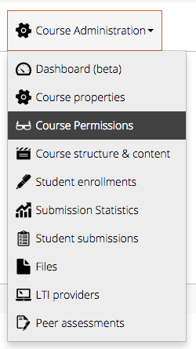
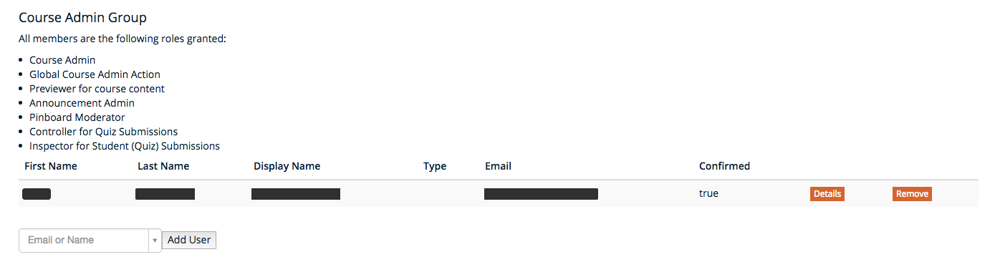

# Granting permissions to users

Platform admins and course admins can grant permissions to a course under the course administration menu.

*Fig. 01: Course Administration => Course permissions*

## Groups

### Course Admins

Course admins can:

- edit the course properties
- edit the course contents
- preview the course content
- create, edit and send course announcements
- moderate the pinboard
- inspect student's (quiz) submissions

*Fig. 02: Granting admin permissions to a user*

### Teachers

Teachers can:

- preview the course content
- preview announcements
- moderate the pinboard
- inspect student's (quiz) submissions

### Moderators

Moderators can:

- preview the course content
- preview announcements
- moderate the pinboard
- inspect student's (quiz) submissions

### Students
Students can:

- access the published course content