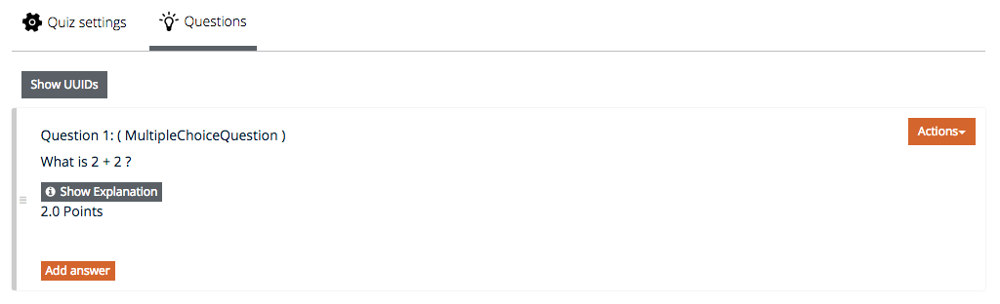

# Adding quizzes and questions

## Adding quizzes
Please, refer to the [adding content page](https://github.com/openHPI/TeachingTeamGuidelines/blob/new_update_2020/docs/05_adding-content.md) for the quiz settings. 

The platform offers the possibility to add graphics or images (best suited are PNGs) for questions and answers. Please scale those files down for webuse before inserting them.

## Adding questions

### Available question types:

**Multiple choice:** Multiple options but only one correct answer. Displayed with radio buttons to signal the user that only one of the options is correct.

**Multiple answer:** Multiple options, more than one possibly correct answer. Displayed with check boxes to signal the user that more options might be correct. It is also possible to use this question type with only one correct answer to raise the difficulty of a multiple choice question.

*Note: once the type of a question has been saved it cannot be changed anymore.*

**Free Text:** Only for short texts. Correctness is tested by direct string comparison.
A correct answer must be specified in the quiz setup, otherwise the quiz will crash.

*Note: we use this type of question only for special purposes, e.g. when a password can be retrieved by solving an external task.*

**Essay:** Only for longer texts. Participants are required to write a comprehensive type answer showing their knowledge and expressing their ideas. It can't be graded automatically, so the instructor has to go through the answers manually and grade them.

*Fig. 01: Select question type*

### Adding the question:

**Question type:** can be any of *Multiple Choice*, *Multiple Answer*, *Essay* or *Free Text*

**Question text:** the actual question

**Explanation:** explanations can be added for both questions and answers and will only be visible after the student has submitted its solution.

**Points:** the max. amount of points to be earned for this question.

**Shuffle answers:** if "ON" the answers will be shown in random order.

*Fig. 03: The question has been added*

### Adding answers:

*Fig. 04: Add new answers*