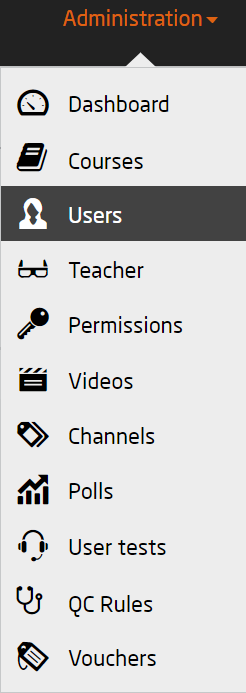
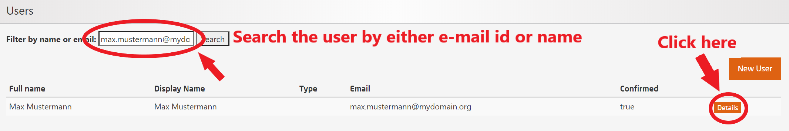
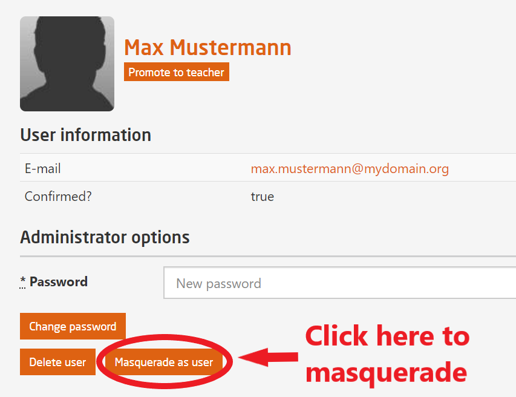
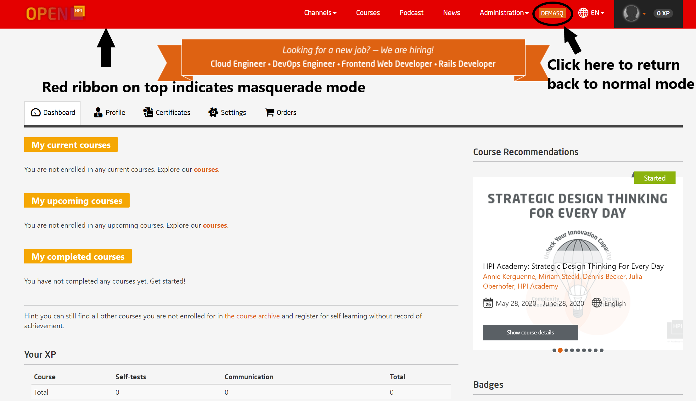

# Masquerade

This feature can be used only by **course administrators**, **teachers** and **course moderators**. It is a very handy tool to search or create a user. It is not advisable for teachers to create a user, however they forward a request to the admins for the creation.  
This tool allows you to enter inside the user account of a particular user without the need to login. Upon gaining access, you can view and modify the account just like the user itself.  
We use this tool to troubleshoot any account related issues faced by the user.  

## Search user

  

*Fig. 01: Select Users from the Administration (not to be confused with Course Administration)*

After selecting the User tab, we are redirected to the user search page, where we can search for a user based on its name or registered e-mail id as shown in *Fig. 02*.  

  

*Fig. 02: Select Users from the Administration (not to be confused with Course Administration)*

Find the user and then click **Details** and you will be redirected to the details page.

  

  

*Fig. 03: User's detail page*

Here, you can delete the user, change its password, promote him/her to teacher's position or masquerade as the user itself. Follow the instruction in *Fig. 03*

## Masquerade as user

  

*Fig. 04: Inside the user's account*

As you can see in *Fig. 04*, there is a red ribbon on the top of the screen which indicates that we are in masquerade mode. Here, you can view and modify the profile, courses, settings etc.  
Once you are done with your stipulated work, click on the **DEMASQ** button situated at the top right side (as shown in the *Fig. 04*) to return back to your own page.