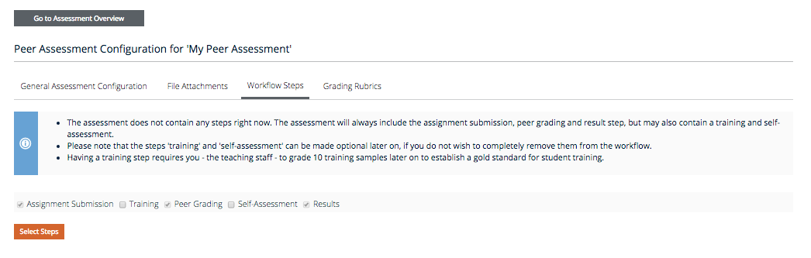
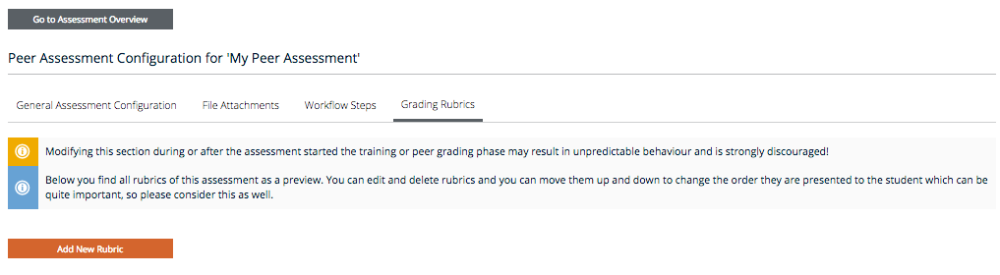

# Peer Assessment

## Create Item
To create a peer assessment item, go to *Course Administration=>Course structure and content* and click the *Add Item* button. 
Title, advanced settings, etc. are the same as for any other item type. 
In most cases you will not need the advanced settings.
Select type Peer Assessment. For exercise type set either *Main* or *Bonus* (Self test and Survey do not make sense here). 
Points for a peer assessment of type *Main* will bve added to the amount of achievable points. Points for a peer assessment of type *Bonus* can be used to make up for regular points that have been missed. In this respect peer assessments behave just like standard quizzes. 

*Fig. 01: Create peer assessment item* 

The last option *New/existing assessment* lets you either create a new peer assessment or link to an existing peer assessment. Linking to an existing peer assessment does not copy the assessment but only generates a link to the existing assessment. This can be useful if the peer assessment is distributed over several weeks and should be accessible from within each week. Alternatively, the peer assessment can be located in a seperate section that is not within the default week-based structure.

## Peer assessment settings
To set up the peer assessment go to *Course Administration=>Peer Assessment* 

*Fig. 02: Open the peer assessment settings* 

### General settings

*Fig. 03: General settings for the peer assessment*

### File Attachments

*Fig. 04: Add files to the peer assessment*

### Workflow Steps

*Fig. 05: Select the workflow steps for the peer assessment*

### Rubrics

*Fig. 06: Add rubrics for the peer assessment*

