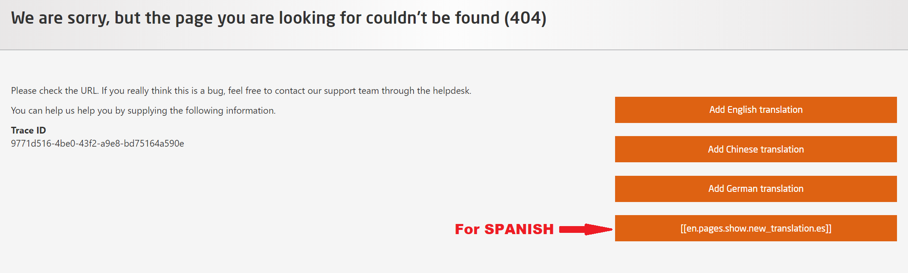
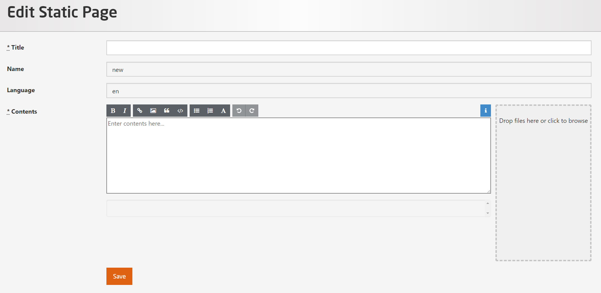

# Static Pages

As a platform administrator, you can add new static pages by the following method:  
    
    Go to the URL bar and type:
    https://open.hpi.de/pages/new
    

  

*Fig. 01: Static Page*

    Note: The last button shown in Fig. 01 is for Spanish

Once you are on that page, you can add a page of your choice by clicking either of the buttons.  

## Static Page in English  
After clicking on **Add English Translation** you should get this page -  

  

*Fig. 02: Edit Static Page*

You can define a new **Title** but you can not edit the **Name** and **Language** as those are already pre-defined. Add your contents and once you are done, click the **Save** button. 
You have the option of creating your static page in English, German, Chinese and Spanish.  