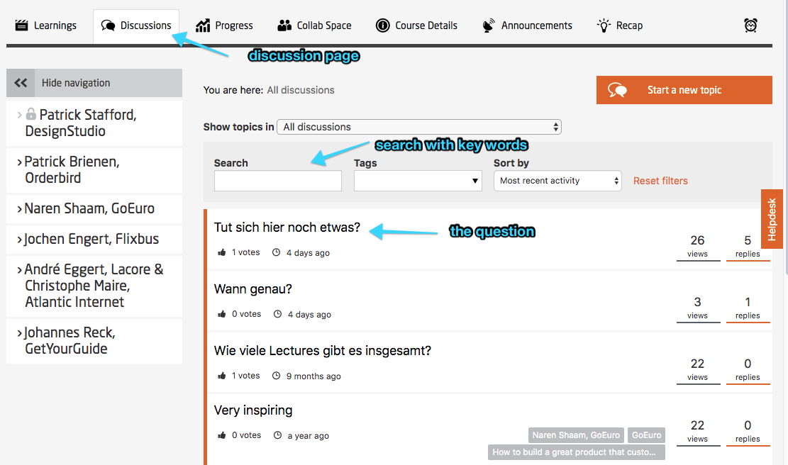
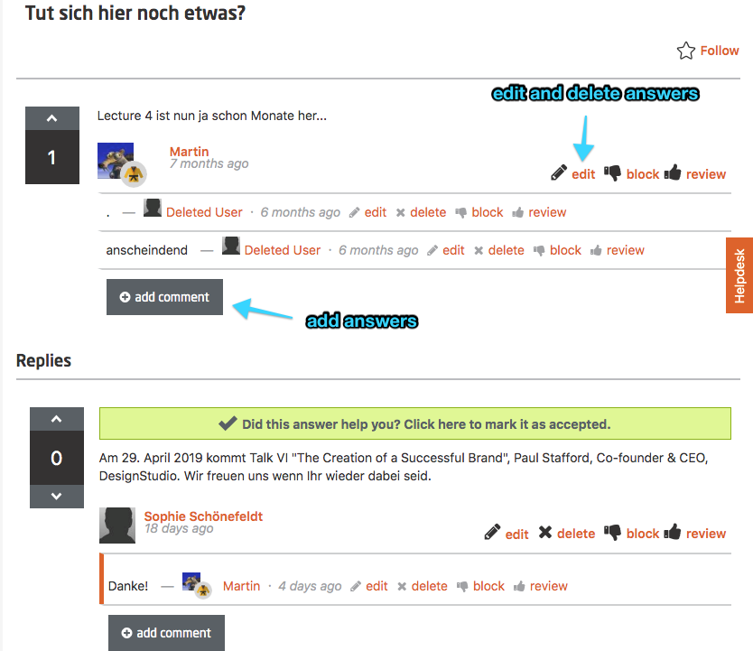
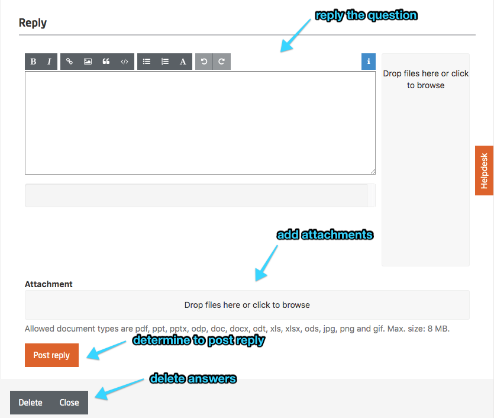
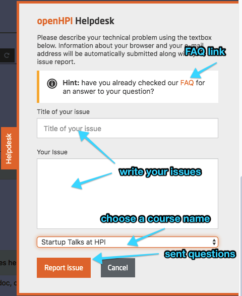
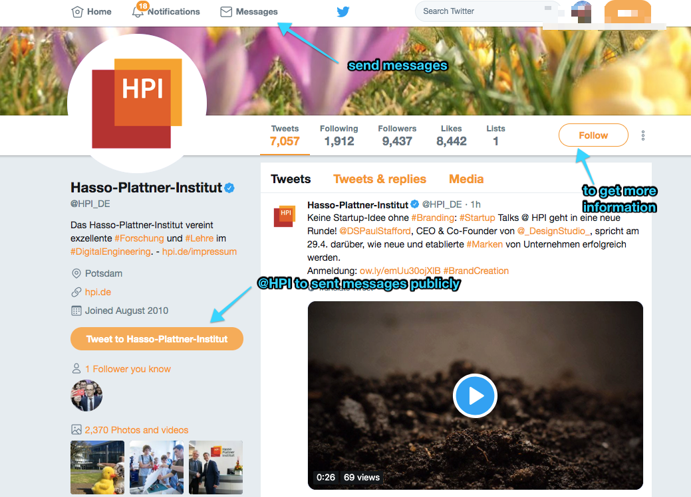
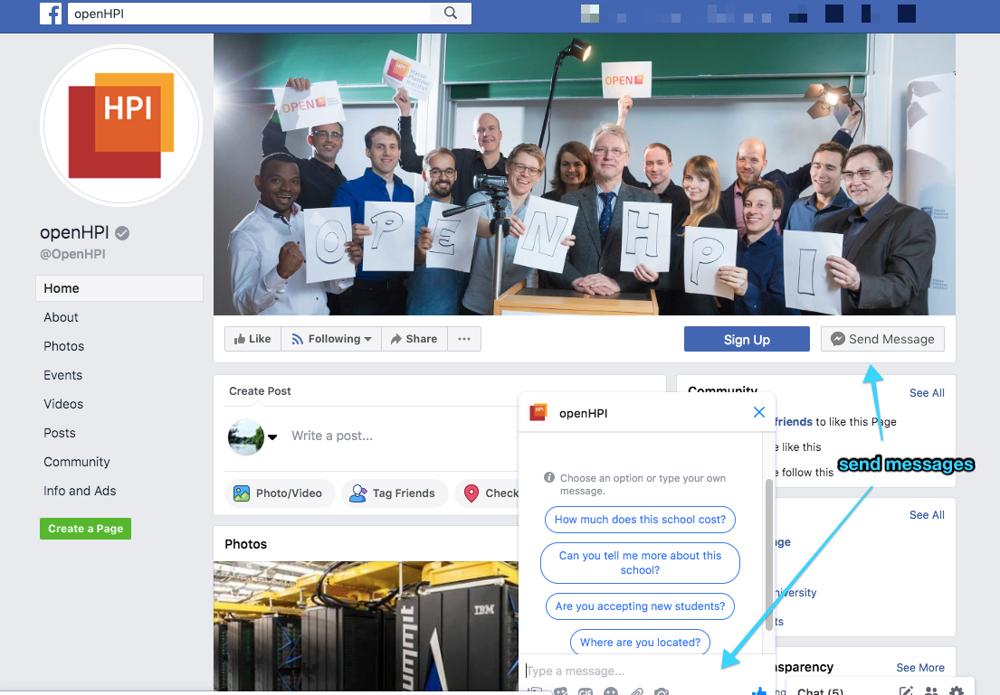

# Supporting & looking after your community

For contact with the learning community you can chose from the following channels:

 - [Discussionfora]()
 - [Helpdesk / Technical Support]()
 - [Social Media (Twitter, Facebook, etc.)]() (contact: Frank Wittmann)
 - [openHPI-Blog]()
 - [Course-Announcements (Newsletter)]() – Messages to all course participants

We suggest to use these communication channels for different types of communication.
[openHPI Kommunikation Matrix]()

Global announcements – messages to ALL openHPI users (not course specific) have to be coordinated with the platform team.

## Conventions

*Communication and appearance*

The teaching team and technical support should use and agree to the same communication scheme for the community and with participants and in the forum
 (if needed in different languages) vereinbaren. For example

 - Address (bspw. „Sehr geehrte Frau Muster“, „Dear Peter“)
 - Signatur, examples:

		Mit freundlichen Grüßen / Best Regards,
		Christian Willems
		openHPI Team

  - User name (e.g.. Christian Willems (HPI))
The following conventions have proven to work out alright
 - Address as personal as possible and informal (only first name)
 - To formal posts – answer in a formal way as well (is an email or a posting signed with full name please answer accordingly)
 - How to deal with difficult/critical/impolite Mails or Postings:
 - Don’t answer right away, please wait a few hours or a day after reading (after emotions have cooled down)
 - Be polite, yet consistent
 - In case of rude approach please answer "We will be happy to try and solve your problem together but we do not encourage this tone."
 - Support will be provided by openHPI team

## Sanctions

In case of disregarding Netiquette, the forum rules or the code of honor suitable sanctions need to be prepared – if required in different escalation levels. To these belong:
 
 - Personal or public admonition
 - Temporary blocking of access to openHPI account
 - Permanent exclusion from a course
 - Permanent exclusion from the platform

It is important to handle sanctions carefully. The experience of the past courses show, that usually the community takes care of sanctions and admonitions in case of disregarding forum rules or aggressive communication towards the team.

## Discussion Forum

The available for a in a course can be divided into the “Common Forum” and the “Weekly Forum”. In the weekly forum more specific questions about weekly course topics can be discussed. In the general forum as well as technical discussions. Technical discussions should be tagged as such so that they can be found in the appropriate area.

In addition there a fora available which are linked to video and for a linked to a certain learning group. The allocation of threads to certain fora happens via tags which are set implicitly. Further, tags can be tagged explicitly as well. The general forum comprises all threads of a course not only the general threads but also the weekly specific threads. When navigating to a week-specific forum, this has some kind of filter impact on the selected threads. The week-specific forum consist of all the video-specific threads of a course week.

As mentioned before, a fixed team should take care of monitoring the forum discussions. (if needed with a schedule). Here, technical questions, who are not targeted at the community, should be answered as soon as possible. Especially critical posts and mentioning of errors. It is important to be especially attentive to possible mistakes in the weekly assignments. Here it is important to react very quickly as these can cause frustrations among the learning community.

Content related questions can remain a bit longer without the reaction of the teaching team. Here, answers should come from the learning community. But here as well – after latest 36 – 48 hours without any answer the thread in question should be handed over to a qualified teaching team member who answers correctly. Answers from the community should be monitored as well – after a certain while a qualified team member should check, whether the answers from the community are correct.

It also can happen, that content discussions can become very emotional. Here a team member should moderate or reconcile, if required. If the discussion becomes very unobjective, he or she should step in in any case.

Certain discussion topics can be emphasized via “Sticky Post” feature. Marked as “sticky”, forum posts appear on the first rank of the forum

A little hint: the learning community appreciates posts by the course lecturers / teachers themselves.

*Fig. 01: open the page of discussion*

*Fig. 02: answer one of the questions*

*Fig. 03: edite answers*

## Helpdesk / Technical Support

In general, the technical support should only happen via Helpdesk. In case that individual technical questions arriving via forum or email the sender should be ask to come back via Helpdesk. This is also important to communicate at course start. (in the welcome message).
Technical questions posted in the forum which are relevant to other users as well can be discussed there. As well as technical questions, which arrive via helpdesk – (sometimes many arrive to the same topic) can answer the teaching / support team in the general forum via sticky post in case they are relevant to other users.

*Fig. 04: write a ticket at helpdesk*

## Social Media

Support requests or content related questions addressed at the teaching team via Social Media (Twitter or Facebook Messages) should be forwarded to helpdesk or discussion forum. Are these public requests, the forwarding should take place to other channels as well.

*Fig. 05: sent messages on twitter to @HPI_DE or @openHPI*

*Fig. 06: sent messages on twitter to @HassoPlattnerInstitute @OpenHPI*

