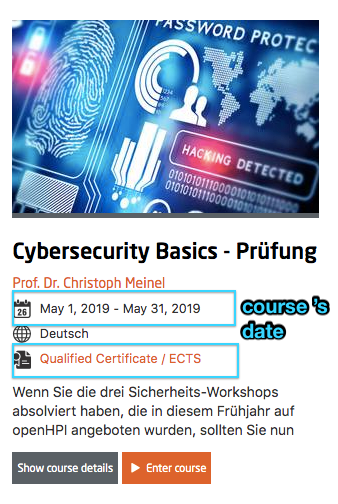
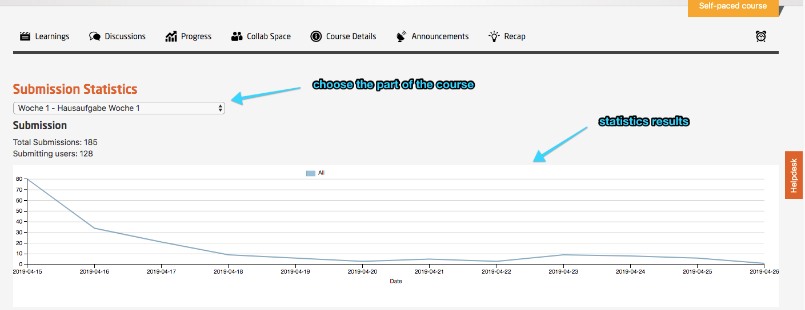
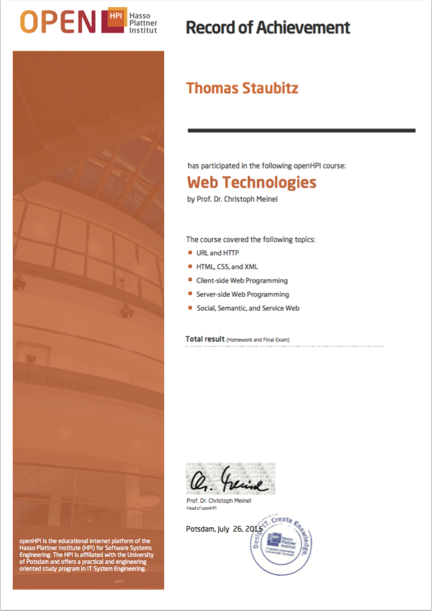
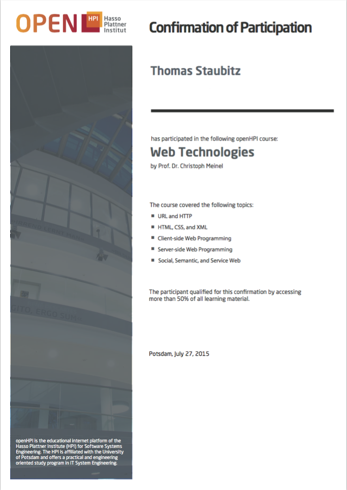

# End of Your Course / Wrap Up

## Course End Date

Please make sure that the course's end date is not before the deadline of the final exam or the last weekly assignment. We recommend, that there is a difference of at least 3-4 hours. 

As often the course end date is initially set to the date when the "official" part of the course ends, but in fact the course provides the chance to work for some more time on the lasst weekly assignment or the final exam, this date, currently, needs to be re-adjusted not later than during the last week of the course. (A ticket exists to provide the possibility to add two end dates, the official and the effective. So this will no longer be necessary in future.)

*Fig. 01: course date information for the current course*

## Course Summary

 - If there is interest in special statistical data from the course, the generation of those statistics can be discussed with the platform team. These are also interesting to the learning community. 
 - At the end of each course statistics and special course characteristics should be published on suitable places on the course site and also on the openHPI Blog. Relevant articles of the teaching team are explicitly desired and very welcome.
 - The platform team is very interested in Feedback of the teaching teams, particularly in feature requests that help to improve the system.
 

*Fig. 02: statistics for one course item*

## Settings to be changed at the end of the course

At the bottom of the course settings page, open the *General advanced settings*.
*Auto archive after course* end should be already on. If not: switch it on.

As soon as the templates for the records have been provided (see the following section) and the deadlines of the final exam and the last weekly assignment have passed, the records for the course can be generated. We recommend to add a buffer to allow possible regradings to be discussed and executed of at least two days between the last deadline and generating the records. 

## Documents, Records, Certificates, etc.

Currently, the documents are generated by the platform team. A self-service for this option will be offered in future.

To generate the documents, the platform team needs the following input:

 - The lecturers signature in digital form (png, pdf, jpg). (please use a marker on white background)
 - The certificate template without the dynamic data
 - The certificate template including the dynamic data
 - Information on which dynamic data should be displayed

Currently, the following data is generated dynamically:

 - User name, this is the user's firstname and lastname as given in the user's profile (not the display name that is used on the platform, e.g. in the forum). (mandatory)
 - User email. (mandatory)
 - User date of birth (the user can decide if it should be displayed or not in the profile settings). (mandatory)
 - Received points and available points (xx of xx points). (optional but strongly recommended, RoA only)
 - User is part of the top 5, 10, 20 %. (optional but strongly recommended, RoA only)
 - Verification URL (mandatory, RoA only)
 - Verification QR code (mandatory, RoA only)

Currently, the following data should be provided on the template statically:

- Document type (Certificate, Record of Achievement, Confirmation of Participation)
- Course title
- Teacher
- Course length
- Covered topics
- Date of issue
- Logo of institution

Depending on the templates, the process of adjusting the system might take some time. So, the material needs to be provided at least two weeks before the documents are supposed to be issued.

### Document Types
Currently, the platform supports two document types, *Record of Achievement (RoA)* and *Confirmation of Participation (CoP)*.

To earn a RoA, a user has to achieve a minimum of 50% of the available points in all assignments.
We do not round but floor the percentages at this point. So 49.9% is not enough.

To earn a CoP, a user has to visit a minimum of 50% of the available material. (Currently, starting a video is sufficient, a user does not have to watch it to the end - a fact that we do not comunicate in general).

In future, a third document-a *Certificate* will be offered. Basically, the requirements are the same as for the RoA. Additionally, the user will have to buy *Veriface*, a tool to verify that the registered user has taken the exam. The certificate will contain an image of the user which has been taken during the veriface calibration phase.

Following are some examples for CoPs and RoAs templates and final documents. 

#### Record of Achievement

##### The Template (without dynamic data)

*Fig. 03: Template for Record of Achievements*

##### The Document (including dynamic data)

*Fig. 04: Exemplary Record of Achievements*

#### Confirmation of Participation

##### The Template (without dynamic data)

*Fig. 05: Template for Confirmation of Participation*

#### The Document (including dynamic data)

*Fig. 06: Exemplary Confirmation of Participation*

