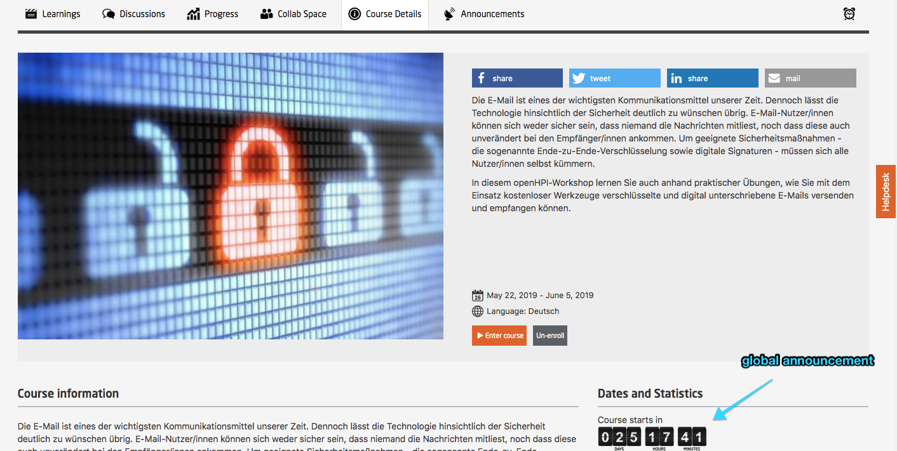
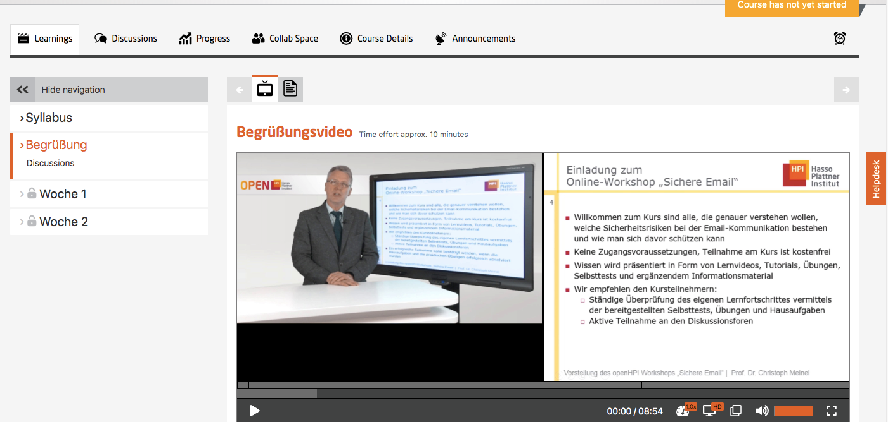
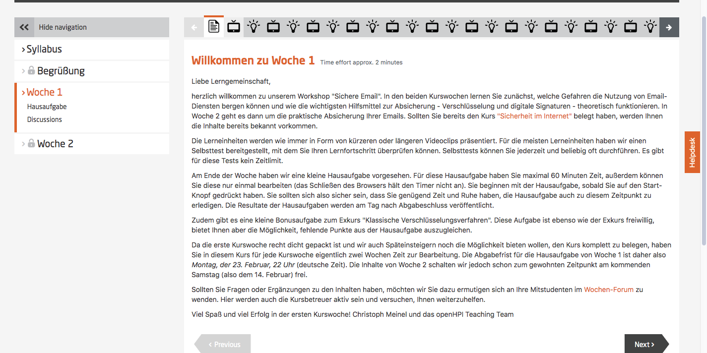

# Communication Matrix

About this matrix:

<table class="tg">
  <tr>
    <th class="tg-031e">What When</th>
    <th class="tg-031e">As soon as the course is online </th>
    <th class="tg-031e">4 weeks before the course </th>
    <th class="tg-031e">Friday before week 0 </th>
    <th class="tg-031e">Friday before week 1 </th>
    <th class="tg-031e">Week 1 (Monday) </th>
  </tr>
  <tr>
    <th class="tg-031e">Course Announcement </th>
    <td class="tg-031e"></td>
    <td class="tg-031e">Global Announcement </td>
    <td class="tg-031e">Course Announcement: Content of week 0 </td>
    <td class="tg-031e">Welcome message to all registered course participants </td>
    <td class="tg-031e">Course announcement for following week n </td>
  </tr>
  <tr>
    <th class="tg-031e">Messages on the Platform </th>
    <td class="tg-031e"></td>
    <td class="tg-031e"></td>
    <td class="tg-031e">Welcome message on course page </td>
    <td class="tg-031e"></td>
    <td class="tg-031e">Message: even with late registration successful participation is possible </td>
  </tr>
  <tr>
    <th class="tg-031e">Discussion Forum </th>
    <td class="tg-031e"></td>
    <td class="tg-031e"></td>
    <td class="tg-031e">Who is there? Introducing to your class mates </td>
    <td class="tg-031e"></td>
    <td class="tg-031e">Responding to most common administrative and content-related questions </td>
  </tr>
</table>

Example for a [course Announcement](https://blog.openhpi.de/2016/02/course-on-internet-security-starts-on-february-8/)

*Fig. 01: a global announcement for a course*

*Fig. 02: welcome video on the course page*

*Fig. 02: welcome message on week 1*