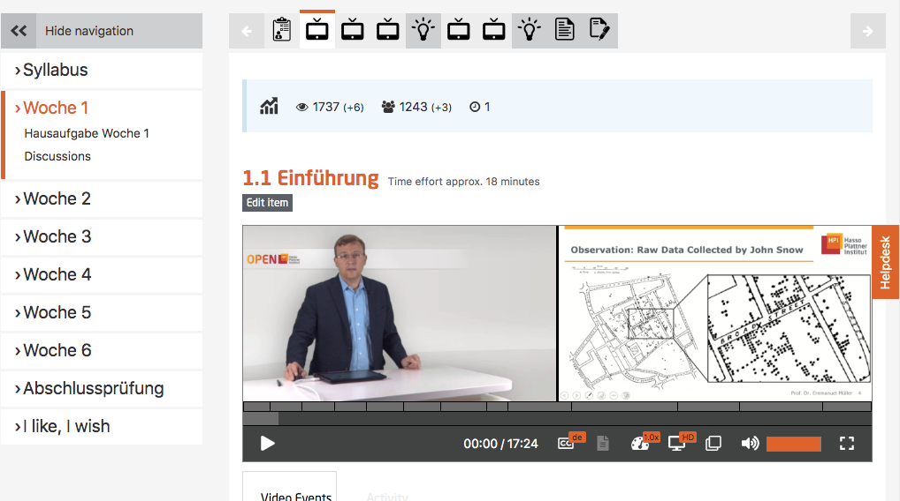

# Preparation of course materials

We recommend to start with the preparation of the course materials at minimum 2 months (or earlier depending on the course structure) before course starts.

 The first task here is the design of the course outline.
 
## Recording of lecture videos in the studio
 
Tips from the camera crew:

-	Please start recordings well prepared. Slides should be prepared, if required talk them through.
-	Because of green screen background, please refrain from wearing green attire.
-	Please avoid finely checked clothing or with small patterns as they are not desirable for video recordings either.
-	Please look after your appearance, it should be well-groomed (keep in mind that several thousand people will watch your style.)
-	Due to the studio lights it can become quite warm in the recording room, so dress accordingly. 
- Ask your team to assist you during the recording.
- If you prepared speaker’s notes, then it should not be more than 1000 words or about 7 minutes worth of video.
- Look directly into the camera.
- Give your audience a smile.
- Put it as simply as possible.
- Speak at a decent pace and clearly.
- Use short sentences.
- Make sure to explain abbreviations and technical terms.
- At the end of the video stay in front of the camera for a moment and keep smiling (makes it easier for the media technicians to cut).

 
## Teaser and Course Introduction Video

It has proven in the past, that it makes sense to create a short video teaser, (apart from the course introduction video) This short teaser video shouldn’t be longer than 90 seconds. The teaser is used for marketing purposes, so try to include the following points as briefly as possible:  
- **Who?** - Short welcome and introduction of the course instructor
- **What?** - Title, format, duration, language of the course
- **Why?** - Facts, possible problems, deficits, challenges, mention the target audience

 The course introduction video will have a more detailed overview of course content, structure and perhaps the typical course cycle.
Both the videos should be published on YouTube or other video platforms and the registration link along with the teaser video should be shared in social media. The YouTube links should also be provided to your PR department.

*Fig. 01: course introduction video* 

