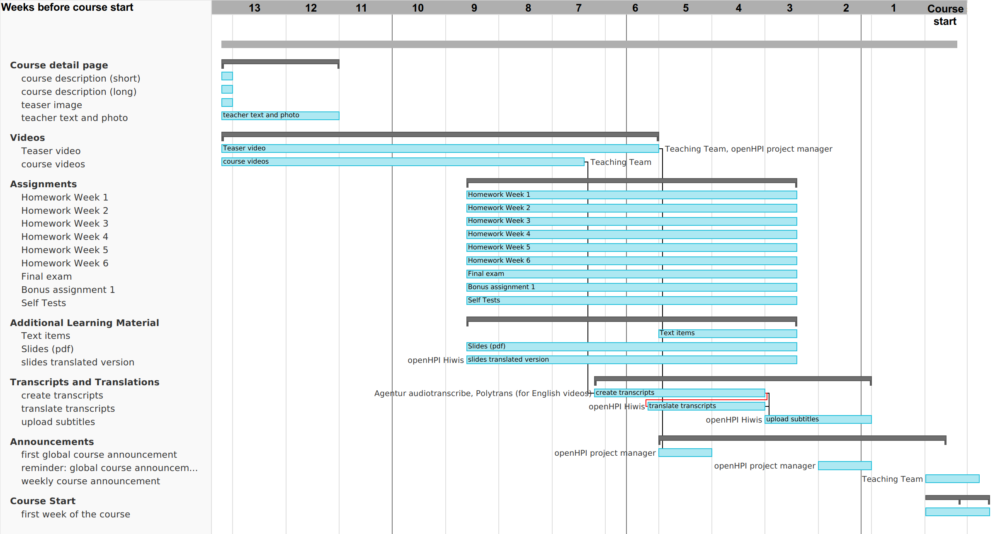

# Course Production Timeline  

Respective members of the teaching team are required to follow the course production timeline within the span of ****13 weeks**** prior to the commencement of the course, as described in the Gantt Chart.  

  
*Fig. Gantt Chart for the openHPI course production timeline*  
 

## Course Detail Page  
A course details page must be completed **11 weeks** before the course begins and should contain the following:  
* A short course description (**13 weeks** before the course starts)
* A detailed course description (**13 weeks** before the course starts)
* A teaser image of the course (**13 weeks** before the course starts)
* Photograph and brief details of the course's teaching team (**11 weeks** before the course starts)

## Videos  
The following videos should be produced **5 weeks** before the course starts:  
* A teaser video of the course to be prepared by the teaching team and openHPI project manager (**5 weeks** before the course starts)
* All the course videos to be prepared by the teaching team (**6 weeks** before the course starts)

## Assignments  
Preparation for all the assignments and tests should begin during the video production with a target to finish **2 weeks** before the course starts.

## Additional Learning Material  
* Lecture slides (in PDF) and text items should be published **2 weeks** before the course starts.  
* If there is any requirement for translating the lecture slides, it is done with the help of openHPI HiWis and must be finished **2 weeks** before the course starts.

## Transcripts and Translations  
* Once the course videos are ready, transcription and translation begins.  
* Transcripts and their translated versions must be uploaded to the openHPI platform **1 week** before the course starts.

## Announcements  
* **4 weeks** before the course starts, openHPI project manager will make the first global announcement of the course.
* **1 week** before the course starts, openHPI project manager will issue a reminder pertaining to the global course announcement.
* After the course begins, the teaching team will make weekly course announcements.