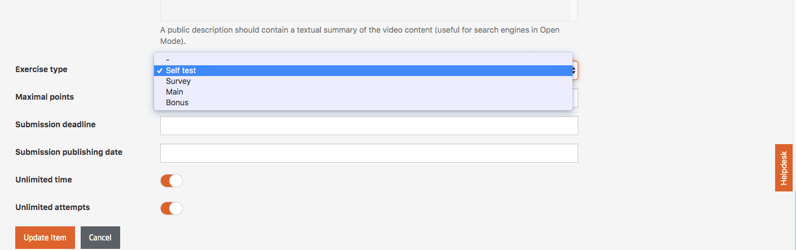
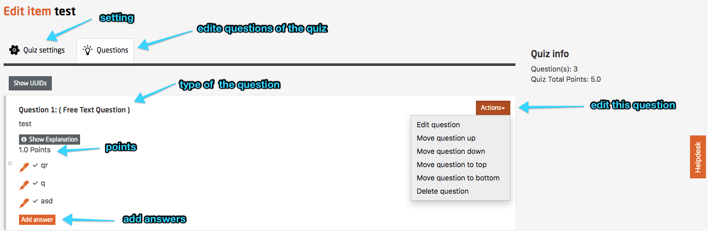
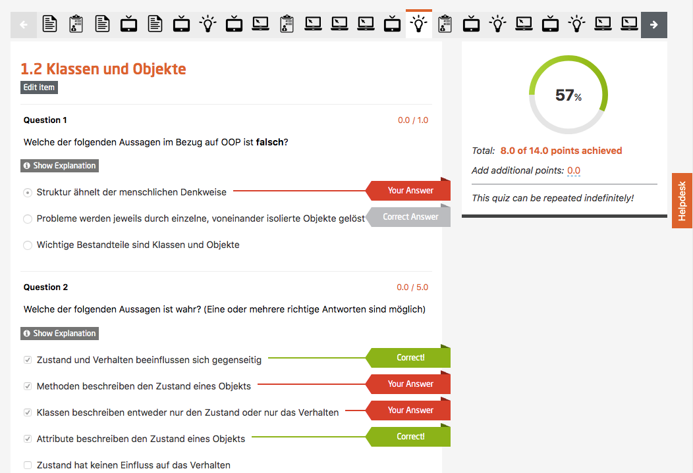

# Quiz Design
## General Remarks

The term quiz is used here for any kind of test or assignment. The quiz tool of the platform allows to create the Self-tests, the Weekly Assignments and the Final Exams.
Generally, the following is essential: When designing questions for quizzes, it has proven successful to start creating as many questions as possible for each single video item. The best is to do that, while choosing the course content and presentations for the videos. Based on this pool of questions it can be decided which questions to choose for self tests and which for assignments. The weekly assignments should be complemented by some questions, which desire the application and transfer of the acquired knowledge. Weekly assignments can also contain modified questions from the self-tests. The same applies for the final exam.
For all questions in the quizzes a thorough quality check is vital. Unclear answers should be avoided in any case. Distractors (wrong answers to choose from in a multiple choice quiz) have to be researched thoroughly. Perhaps there is an internet source people can use to state that this choice is a correct answer? Mistakes in quizzes lead to undesired frustrations among the the learning community or discussions in the forum. In the worst-case scenario, they might require a re-grading. For self-tests, however, it might be intended to trigger discussions by "unclear" questions. With "unclear" we do not mean badly designed but rather something such as rare edge cases, etc. These discussions can be leveraging the learning process.

The University of Texas provides some [good advice]((https://www.utexas.edu/academic/ctl/assessment/iar/students/plan/method/exams-mchoice-write.php)) for creating multiple choice questions.

*Fig. 01: select the type of the quiz*

## Self-Tests

Self-tests help repeating and deepening the learnings from the previously seen video clips. Content-wise, questions should be designed in a way, that they take up the most important learnings and findings from the videos. 
Alternatively, self-tests can also be used to encourage the students to deepen their knowledge, e.g. with some research of their own.
Depending on length and level of difficulty, video content should be reflected within 2-5 questions.
The points users can earn for self-tests should, in general, match with the ones from the weekly assignments. The number of points for a question depends on its type and the level of difficulty. In general, multiple-answer-questions are considered to be more difficult than multiple-choice-questions. 

Questions with more answers to choose from should earn more points. The amount of points should not match the number of correct answers, however.
For multiple-answer-questions, the points a user will receive are calculated according to their correct answers. The value of the result is determined by the sum of correct answers. If a student marks a correct answer as correct, he/she will receive the according part of the total points. If a student marks a wrong answer as correct, the according part of the total points will be deducted. Minimum points are always zero, there are no negative points.

	Example: 

	- Question with four answers to chose from: 
		- 2 answers are correct, 
		- 2 answers are wrong. 
		- The teaching team decided to award this questions with 4 points.  

	- Student one:
	   - Marked two answers as correct. 
	   - Both of the answers have been marked as correct by the teaching team as well.
	   ==> Student one will receive 4 points.

	- Student two:
	   - Marked one answer as correct. 
	   - The answer has been marked as correct by the teaching team as well.
	   ==> Student two will receive 2 points.  

	- Student three:
      - Marked two answers as correct. 
      - One of the answers is correct, the other one is wrong.
      ==> Student three will receive 0 points.

 	- Student four:
      - Marked two answers as correct. 
      - Both answers are wrong.
      ==> Student four will receive 0 points.   

**We strongly discourage to tell the students how many answers are correct in a multiple answer question.** Practice has shown that this increases the need for re-gradings, while simultaneously reducing the choice of possible re-gradings.

*Fig. 02: edit questions at quiz part*

## Weekly assignments and Final exam

*Fig. 03: an example about weekly assignments* 

The performance of openHPI learners is measured with weekly assignments and a final exam. 

**We suggest to allocate a total of 180 points per course:**

- 6 weekly assignments, 15 points each => 90 points
- 1 final exam, 90 points

If a different emphasis on certain course weeks is desired, the 90 points for weekly assignments can be allocated unevenly as well. An even allocation is easier to communicate, however.

The calculation of earned points follows the same rules as in the self-tests.

For weekly assignments and the final exam, we suggest to set a time limit and to restrict the number of attempts.

- Weekly assignment: 1 attempt, 60 minutes
- Final exam: 1 attempt, 120 minutes

Some teaching teams have gained good experience with more narrow time slots. This way a *closed book exam* can be simulated.
As this setting is rather unusual on the platform it can (will) lead to undesired help desk traffic and forum posts. 

In case of e.g. technical problems, a second attempt can be given to affected users individually. This is only possible, however, before the deadline of the quiz has passed.

A common scenario is, that a user has started the weekly assignment of the upcoming week instead the one of the current week. In those cases we allow an additional attempt without further discussion.

The quiz would start right away as soon as the learner has navigated to that item. There is **NO** possibility to stop the countdown. Neither the closing of the browser nor unplugging the computer will help in this situation.
The timer can only be stopped by handing-in the quiz. An undesired hand-in of incomplete exam results can lead to a great frustration and “shit storm” in the forum and social media.

## Re-Grading

In case the teaching team learns that a question of an exam or weekly assignment was incorrect or unclear certain options for re-gradings exist.
Re-gradings can only be carried out be the platform team and shouldn’t be necessary in the best case (quality control).

Possible mistakes during quiz design, which can lead to a regrading, can be as follows:

 - Unclear answers. The choice of answers can be interpreted in a way, that is not corresponding to the desired answer scheme.
 - Wrong answers are marked as correct (or the other way around) by mistake during quiz creation.
 - Wrong distractors – answers that were intended as distractors, turn out to be correct. Please, be especially careful with jokes or puns. These not seldom turn out to be actually true.
 - With free text questions it may happen, that students offer a correct answer which is not correctly assessed by the system. For example: A Password is required as an answer. The users receive this password by carrying out an assignment in an external tool. The expected result is „chnFTG56$“. It can happen that the user writes: “Password: chnFTG56$“. In such cases answers can be assessed as correct retrospectively.

**Jackpot:** All users that have answered the question one way or the other receive the full amount of points. This is the backup if nothing else works. Often the only possibility when the amount of correct answers has been given in advance.

**Remove answer:** Removes a wrong answer from the question and recalculates the points. If the concerned answer was marked as correct before (and is now unclear or wrong) this leads to an altered emphasis for the remaining questions. The reason for this is that the value of single answer options is calculated as follows: quotient of total points for a question and the number of correct answer options.

**Change state of correctness:** Sometimes a correct answer has been marked as wrong by the teaching team. This can be corrected via the GUI, but requires an additional update from the platform team.

**Add answer submission:** The platform team can set answers as given directly in the data base. This also requires that an additional update has to be run afterwards.

**Remove question:**
A complete question could be removed from the quiz. As this leads to undesired side effects, such as the recalculation of the amount of overall points, this should be avoided. A Jackpot regrading might be the better choice.

**Add additional correct answer (multiple choice only):** For multiple choice questions additional answers can be checked as correct. This also requires the update skript to be run. If applied to a multiple answer question, the amount of points per answer might change, users that answered the question as it was originally intended will lose points.

*Fig. 04: edit questions of the quiz* 

*Fig. 05: add a new question to the quiz* 

*Fig. 06: an example from the corrected quiz* 

## Background information – Quiz-Engine

Quizzes in openHPI are saved "versionized", which means that each editing (and publication) of a quiz generates a new version. If a user wants to take the quiz, a copy with the latest version of that quiz is stored in a database table. Therefore, a modification of the already released quiz doesn’t have an impact on already submitted questions. Some - (e.g. Jackpot) only corrects the POINTS for submitted answers, not the answers themselves. So please be aware that an inconsistency between correct answers of a student and her points can arise.

