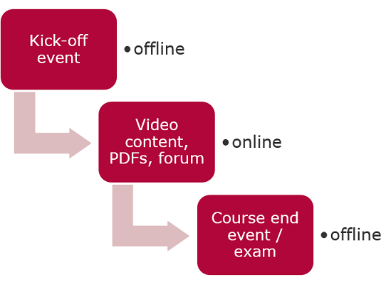

# Blended

These courses are also called mixed-mode courses where a part of the course is delivered traditionally, synchronously face-to-face (either offline or via video conference tools) and other parts are delivered asynchronously online on one of the HPI platform instances (e.g. openHPI).  
In general, blended courses have a more limited capacity of participants due to the synchronously delivered parts of the courses.    

Content and information among the participants and teaching team can be exchanged over [Discussion Forums](https://teachingteamguidelines.readthedocs.io/#features/discussionforum/) and [Collab Spaces](https://teachingteamguidelines.readthedocs.io/#features/collabspaces/)  

  
*Fig. Schematics of the Blended course*
