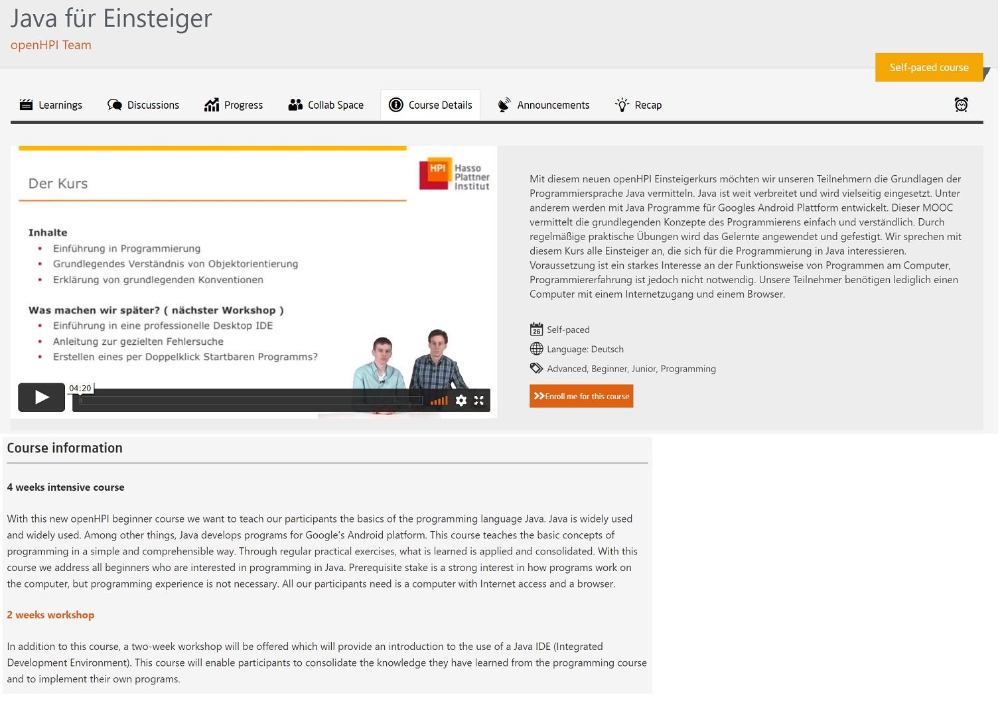
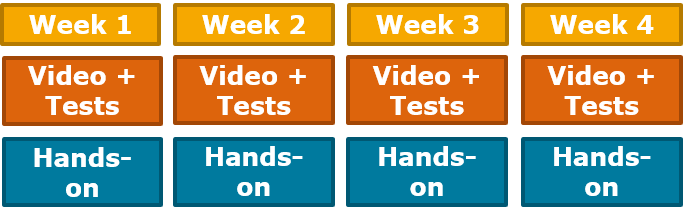

# Hands-on

These type of courses lasts up to **4 weeks** where you learn to solve practical problems and are given hands-on tasks.  

Mostly these type of courses contains programming and practical oriented lessons.  
 

  
*Fig. Example of a Hands-on course available at openHPI*  
 

  
*Fig. Schematics of the Hands-on courses*