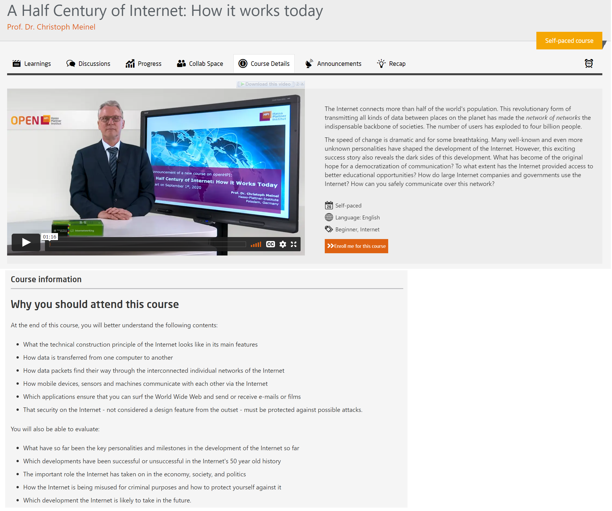
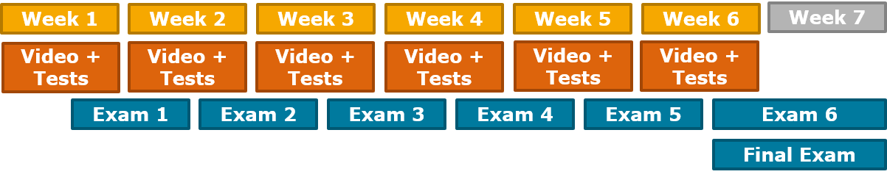

# Lecture

These are in-depth courses like any lectures available in a University or higher learning institutions.  

These courses might last up to **6 weeks** with more weightage on theory rather than practical tasks.  

Participants will be given graded assignments at the end of each week and they have to appear for a final examination after finishing the course.  

These are non-intensive self paced course, however, the graded assignments carry a certain deadline.  

Participants will also be required to perform peer assessments and self assessments during the course depending on the course guidelines. To learn more about peer assessments, please visit [Peer Assessment](https://teachingteamguidelines.readthedocs.io/#features/itemtypes/peerassessment/) and [Peer Assessment Settings](https://teachingteamguidelines.readthedocs.io/#courseadministration/addcontent/learningunits/peerassessment/).  

At the end of the course, participants will be awarded **Confirmation of Participation** and **Record of Achievement** after successfully completing all the criteria as mentioned in the course guidelines.  

   

  
*Fig. Example of Lecture course available on openHPI*  

 

  
*Fig. Schematics of the Lecture courses*