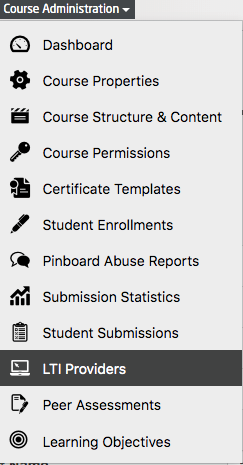
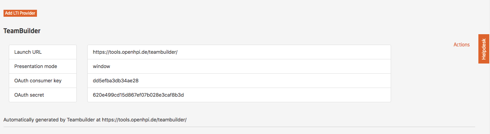
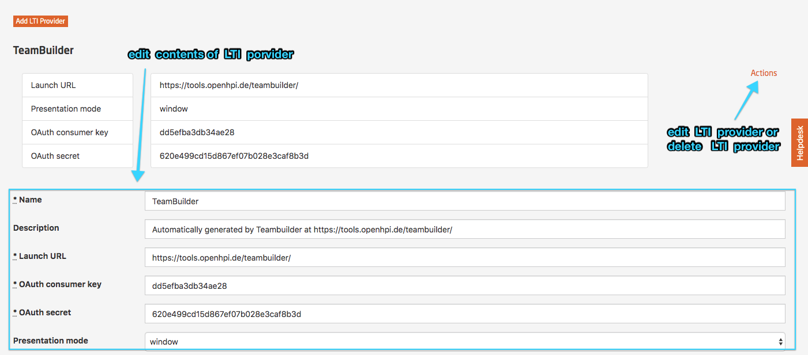
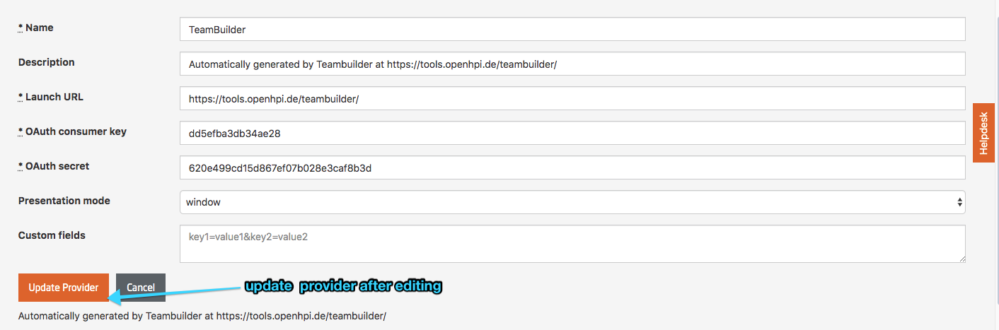

# Integration of External Tools via LTI

## Introduction

The HPI learning platform features many dedicated interactive components for a majority of MOOCs, and we recommend using these native elements if possible. They are supported by our team and have proven to be stable and fit most learners need. However, we also offer an interface to connect the HPI learning platform to any other third-party tool to extend the learner's experience with additional, unique features.

### Usage Scenario

The interface offered by the HPI learning platform is a web-based link technology supporting the access of external educational resources. Opening an external offer through the interface has two main advantages:

- Learners are recognized (with a reduced information set) using a Single Sign-On within the external application. This allows a unified learning experience with saving the current progress and continuation on another device.
- The external tool might return scores for activities back to the course within the HPI learning platform. These are handled similar to other scores and, depending on the settings, either count towards the certificate or self-test points.

We recommend using the interface only for interactive, trust-worthy exercises and tools. In order to comply with privacy regulations, non-native LTI providers won't have access to personal user data as part of the Single Sing-On request by default. Especially web links to external resources should not make use of this platform feature and should instead rely on the linking mechanism offered within the rich-text items.

### Technical requirements

Connecting an external offer requires compliance with a few supported web standards as defined by the MOOC platform. Our interface is based on the [Learning Tools Interoperability](https://www.imsglobal.org/activity/learning-tools-interoperability) standard, to which we will refer as _LTI_ in the following. The LTI standard is one of the most common standards in the area of learning tools and widely adopted within the industry. Many other platforms (such as Moodle or edX for example) also support that. It offers great support for the features required for use cases within the learning environment and provides the two main advantages listed in our [usage scenario](#usage-scenario). LTI uses the [OAuth](https://oauth.net) standard for secure authorization under the hood and support is hence also required. Additionally, a concrete exercise might be accessed through Deep Linking which enables users to start with the given task immediately without clicking through the external offer to find the referenced exercise. Any achieved score can be submitted (and updated) and is transmitted as percentage of the overall score as a float between `0.0` and `1.0`.

Settings of LTI exercises are similar to those of a multiple-choice quiz, e.g. regarding the type, the maximal points or the deadline. We recommend providing as much information as possible and set those if available in both platforms (the MOOC platform and the external tool) for the best user experience.

## Connecting an External Tool with the HPI Learning Platform

Starting an exercise within an external tool requires to simple setup steps:

1. Setting up the LTI provider
2. Creating a course item using a previously set up LTI provider

Splitting the general and item-specific settings, changes (e.g. in the URL of the external tool) can be handled more easily and re-used between different exercises. Thus, it minimizes the setup process for each item. 

### Linking an LTI Provider

LTI providers are a per-course setting and can be found within the `Course Administration` > `LTI Providers`:

*Fig. LTI Providers in Course Administration menu*

Existing LTI providers are shown on the list and can be updated, deleted or supplemented by a new LTI provider:

*Fig. List of LTI Providers* 

Each LTI provider requires only little information for the setup process. Those are usually defined by the external tool and not know to the HPI MOOC platform. Before setting up an LTI provider, you should familiarize yourself with the required values.

*Fig. Edit LTI Providers* 

- `Name` and `Description` are only visible for course teachers and administrators and should help you to identify the service.
- The `Launch URL` includes an absolute path for the _LTI endpoint_ (not a specific exercise). Consider the tool's documentation for more details.
- `OAuth consumer key` and `OAuth secret` are required for the authorization management and especially the `OAuth secret` must be kept private! If in doubt, you should exchange the values with new ones. Both values must be equal within the course settings and the external tool itself.
- `Presentation mode` allows the selection between `window`, `pop-up` and `iframe`. Generally speaking, we recommend the `window` setting due to third-party cookie policies. 
  - `window` will launch the external tool in a new window or tab - using the full window space for the content.
  - `pop-up` will launch the external tool in a new pop-up - usually implying smaller windows, a minimized address bar and potential issues with pop-up blockers.
  - `iframe` embeds the content within the HPI learning platform - showing the course navigation and providing only a subset of the available space to the tool. Third-party cookies might be disabled in the learner's browser and hence break cookie-based authentication.
- The `Privacy Mode` specifies which data is passed to the _LTI endpoint_ by each learner accessing the tool. Per default, no personally identifiable information is transmitted to any LTI provider defined in the course context to protect the learners' data. If this setting needs to be adjusted, please contact a platform administrator to discuss further details.
- `Custom fields` are LTI specific parameters and are used in accordance with the LTI standard. Refer to the tool's documentation for more details about the parameters available for use. A common value would be `locale=en` to set the desired language of the external tool to English (if supported).

*Fig. Available values for LTI Providers and Save Action* 

Once you put all required values in, you could save the LTI provider and use it in one of the exercises as shown below.

### Creating an LTI Exercise

Providing an LTI exercise is very similar to the creation of a multiple-choice quiz for the general settings. As the main values are treated similar to a quiz, only LTI specific information are added here.

- Providing a value to `maximal points` is **strongly** recommended. It is required to account points to learners (based on the percentage value provided via LTI) and should only be set to `0.0` (default) if no points can be achieved. The value is not transmitted to the external tool via LTI.
- The `Submission deadline` defines the point in time after which a _new_ launch of the external tool will be handled differently. We recommend mirroring this setting to the external tool (if supported) for the best user experience. The value is not transmitted to the external tool via LTI.
- The `Submission publishing date` is used to reveal the score received through LTI. Depending on the external tool, setting this value does not make sense: If the final score is shown in the external tool, it should also be shown on the HPI MOOC platform immediately. The value is not transmitted to the external tool via LTI.
- Choosing an `LTI provider` is required for an LTI exercise to work. Failing to select a valid LTI provider will break launching the exercise. 
- `Additional parameters for this exercise` enable the Deep Linking to launch specific exercises. This value **is** transmitted to the external tool via LTI. Multiple values can be separated by ampersand `&` and are automatically merged with those values specified for the LTI provider. If a key-value pair is defined for the LTI provider and the exercise, those from the exercise take precedence over those from the provider. The configuration parameters are tool-specific and are defined by the external tool (see the according reference for more details).

## Further Resources

Many educational apps support the LTI standard. The [EduAppCenter](https://www.eduappcenter.com) lists many of the available sites offering an LTI interface. Hence, this page provides a good overview about different examples.

### Internal LTI Applications

At openHPI, we use some internal applications via LTI:

- [CodeOcean](../../../features/externaltools/codeocean.md) as an educational, web-based execution and development environment for practical programming exercises
- A tool called [TeamBuilder](../../../features/externaltools/teambuilder.md) to create teams based on user preferences.

### Selection of External LTI Applications

- [PeerStudio](https://peerstudio.org)
- [GitHub Classroom](https://classroom.github.com)
- [Big Blue Button](https://bigbluebutton.org)
- [Piazza](https://piazza.com/product/lti)

### Developer Resources

- [Learning Tools Interoperability Standard](https://www.imsglobal.org/activity/learning-tools-interoperability)
- [Test LTI Tool for debugging](https://lti.tools/saltire/tp)
