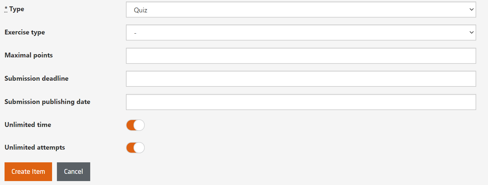
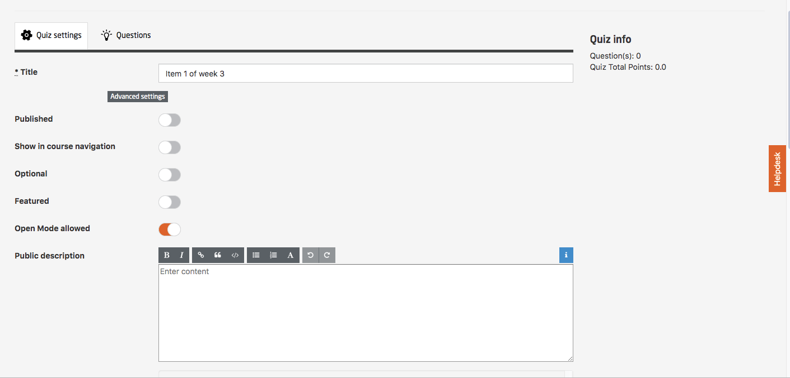
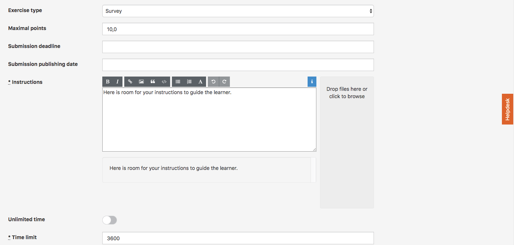
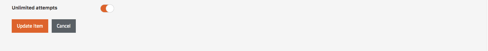
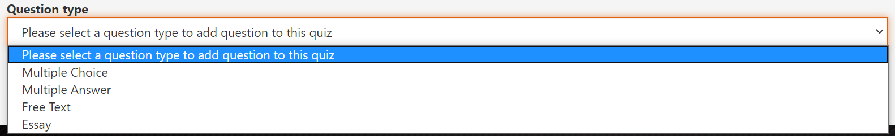
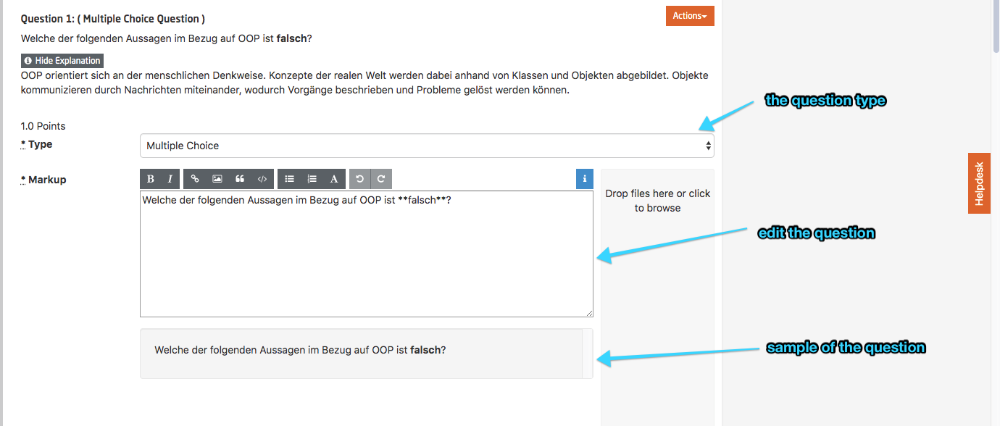
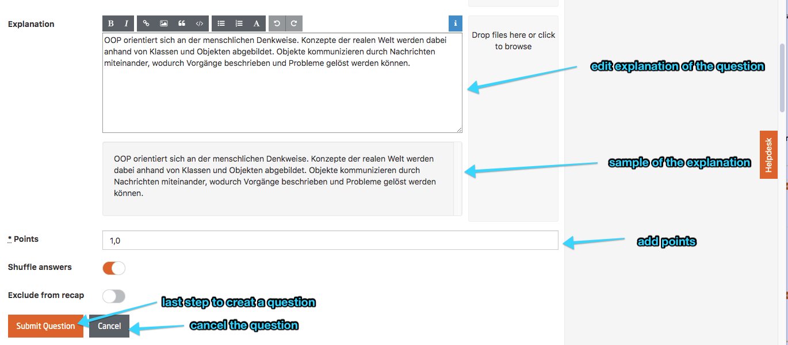
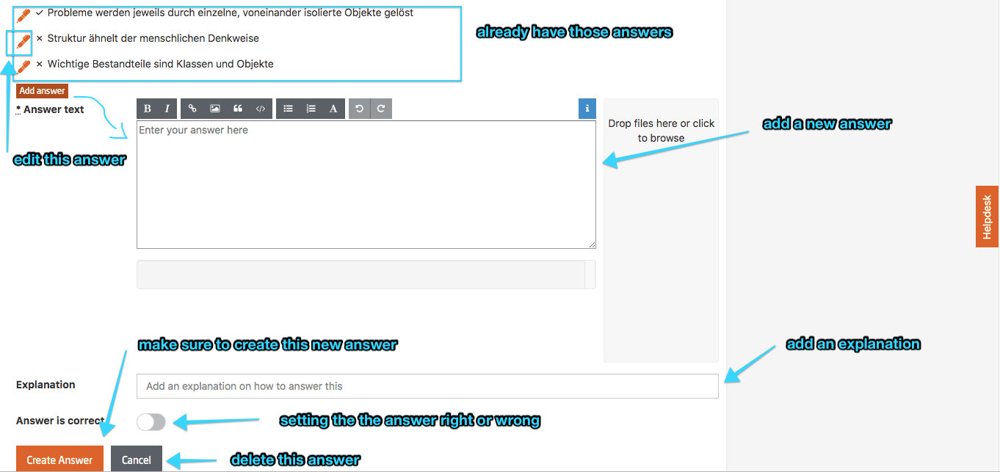

# Type quiz  

  
*Fig. Select Course Structure & Content to add quiz item*  
 

*Fig. Sample preview of the user interface to create quizzes*  
 

  
*Fig. Create new quiz item form*
   

### Exercise type:  
Select among *Self-test*, *Survey*, *Main*, and *Bonus*.  

**Self-tests** are awarded with points, however, they are not counted into the final results at all.  

Quizzes of type **Main** are the weekly assignments (WA) or the final exam (FE). The sum of their points (plus possibly the points from peer assessments and practical exercises) constitutes the maximum of available points (MaxPoints) in the course.  

Quizzes of type **Bonus** are not summing up to the MaxPoints, but they can help to compensate points that have been lost in the **Main** assignments.

Example:

- WA 1 (Main): 15 points
- WA 2 (Main): 15 points
- WA 3 (Main): 15 points
- Excursion (Bonus): 15 points
- FE (Main): 45 points

The participants can achieve a maximum of 90 points.

	User1:

	- WA 1 (Main): 7 points
	- WA 2 (Main): 8 points
	- WA 3 (Main): 6 points
	- Excursion (Bonus): 15 points
	- FE (Main): 35 points

	==> 71 points  

	User 2:

	- WA 1 (Main): 15 points
	- WA 2 (Main): 15 points
	- WA 3 (Main): 15 points
	- Excursion (Bonus): 15 points
	- FE (Main): 45 points

	==> 90 points

**Surveys** are not rewarded with points, nevertheless, to avoid problems it is better to assign at least 1 point to a survey question. FreeText answers require that at least one answer (dummy) is provided, which needs to be marked as correct. Otherwise, the system will break.

**Quizzes come with the optimal presets for their exercise type preselected. Change these settings only if you know exactly what you are doing.**

**Maximal points:** These are the maximal points that can be reached for this assignment. The value is read only and results from the sum of the points for the quizzes' questions

**Submission deadline:** Set the deadline for the quiz. The deadline is hard. After this date it is no more possible to hand in a solution. The results of the participants are autosaved whenever something has changed. When the deadline has passed and the participant is still in the quiz, the results are automatically submitted and the quiz is closed. It is not possible to extend the deadline for single users.  

**Submission publishing date:** The date when the results for the quiz will be published. Should be after the deadline. Should be set for *Main* and *Bonus* quizzes so that participants cannot spoiler the results in the forum. Self-tests, normally, do not have a deadline or a submission publishing date.

**Instructions:** These will be shown on the *quiz intro page*. The value is mandatory even is *Skip intro page* is on (see below.)

**Unlimited time / Time limit:** Self-tests and Surveys should be set to unlimited time, a good choice for a WA is a time limit of 1h, 2h for the FE.
This of course can be adjusted to your needs. If you e.g. want to make sure that participants can answer question by heart, reduce the time limit so that they have not enough time to look something up.

**Unlimited attempts / Allowed attempts:** *Self-tests* are provided with unlimited attempts, attempts for *Main* and *Bonus* exercises should be limited. *Surveys* need to be limited to one attempt.

*Fig. Create new quiz*

The platform offers the possibility to add graphics or images (best suited are PNGs) for questions and answers. Please scale those files down for webuse before inserting them.

## Adding questions

### Available question types:

* **Single Select:** Multiple options but only one correct answer. Displayed with radio buttons to signal the user that only one of the options is correct.

* **Multi Select:** Multiple options, more than one possibly correct answer. Displayed with check boxes to signal the user that more options might be correct. It is also possible to use this question type with only one correct answer to raise the difficulty of a Single Select question.

	*Note: once the type of a question has been saved it cannot be changed anymore.*

* **Free Text:** Only for short texts. Correctness is tested by direct string comparison.
A correct answer must be specified in the quiz setup, otherwise the quiz will crash.

	*Note: we use this type of question only for special purposes, e.g. when a password can be retrieved by solving an external task.*

* **Essay:** Only for longer texts. Participants are required to write a comprehensive type answer showing their knowledge and expressing their ideas. It can't be graded automatically, so the instructor has to go through the answers manually and grade them.

*Fig. Select question type*

### Adding the question:

*Fig. Add question and explanation*

**Question type:** can be any of *Single Select*, *Multi Select*, *Essay* or *Free Text*

**Question text:** the actual question

**Explanation:** explanations can be added for both questions and answers and will only be visible after the student has submitted its solution.

**Points:** the max. amount of points to be earned for this question.

**Shuffle answers:** if "ON" the answers will be shown in random order.

### Adding answers:  

  
*Fig. Add new answers*
