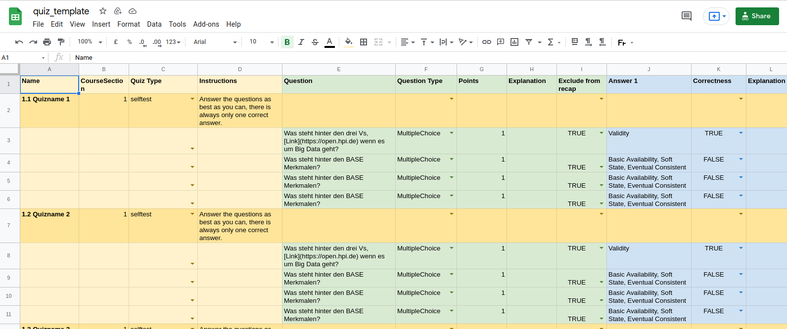
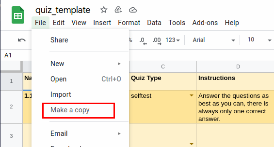
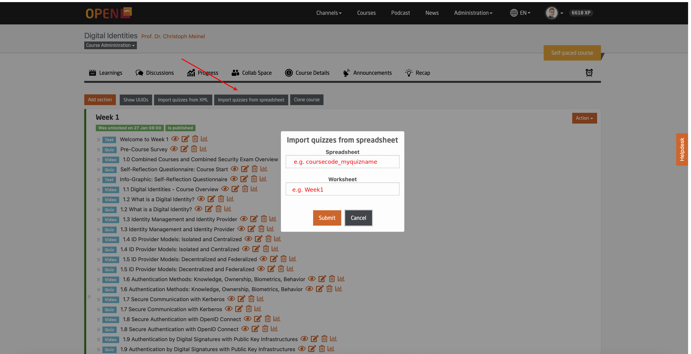

#  Using the Spread Sheet Template for quiz import
In order to add a quiz, you can either use the quiz editor of the platform or you can insert all questions and answers in a Google Sheet document.
This is the preferred way for many, as it saves time and you can adapt and reuse it for other courses.

### 1. Make a copy of this template spreadsheet
You will have to make a copy of our quiz template spreadsheet, that you can find below.

Find the non-to-be-edited quiz structure template [here](https://docs.google.com/spreadsheets/d/1_b8wO9_HlrrHQxagYan1iM6BBK0XtnD6vESxmhnML5s).

**Before proceeding, remember: Please, do not edit directly the template, but make a copy of it - see below how to do it.**

As you see, the spreadsheet consists of different sheets.
Every sheet can be imported separately.
Usually, there is one sheet per week and one extra sheet for the final exam.

Please note that every row after the _Quizname_ rows is a question.

#### How to fill quiz questions and answers

Let's have an overview of the required fields:

##### The infos about the quiz and its type:

- *Name*: the name of the quiz
- *CourseSection*: the section of the course where the quiz is. It must be a numeric value.
- *Quiz Type*: choose the most appropriate type for the quiz: self-test (ungraded), a weekly assignment (graded), a survey, a bonus exercise or the final exam
- *Instructions*: The instructions for taking the quiz. Please note that self-tests do not have instructions

##### Question type, its points and explanation (green cells)

- *Question*: actual text of the question
- *QuestionType*: you can choose between 'multiple answer' ('multiple choice' in the platform) and 'multiple choice' ('single select choice' in the platform). Please note that the other types, like free text and survey, are not supported through the spreadsheet, but only natively via the platform.
- *Points*: points of the question
- *Explanation*: optional explanation of the question

##### The answers to the question (blue and violet cells)

- *Answer1*, *Answer2*,* Answer3*, *Answer4* : the text of the answer
- *Correctness*: choose 'True' for a correct answer or  'False' for an incorrect answer
- *Explanation*: optional explanation of the question and correct answers. This is shown to learners together with the results of the quiz.

### 2. Share your quiz spreadsheet to our quiz service

_Before proceeding with this step, you may want to rename your quiz spreadsheet in a unique way, e.g._: `coursecode_quizname`

Once you have finished filling out the quiz, question and answer infos for each week and homework worksheet, click on *Share* and paste address:
_hpi-openhpi@quizquestions-1191.iam.gserviceaccount.com_

Click *Done* to submit.

### 3. Import your quiz spreadsheet into your course

Now, go to the course section page, click on the 'Import quizzes from spreadsheet' button. A pop up dialog window opens.

Fill out the Spreadsheet name with the **file name** of your quiz spreadsheet (and not the URL)
Fill out the Worksheet name with the name of the worksheet you want to import (e.g. "Week1")
Click on *Submit*.
It may take a little while before the values from your quiz spreadsheet get displayed.
Check the status banner on the top of the page for the status of your import.

### Troubleshooting
If the import returns an error, you will have to check manually again on your spreadsheet for empty or wrong values.
Once you have manually corrected the issues, please redo step 2 and 3.

