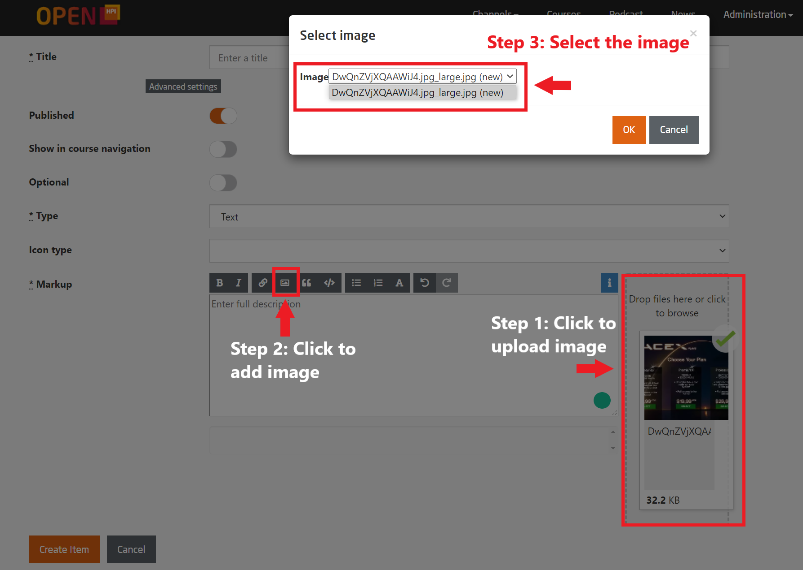

# Type Text

The provision of reading material can be generally carried out in three forms: 

 - directly as a text item, 
 - as a PDF download (within a text item, forum discussion, etc. ), or 
 - as a web link (within a text item, forum discussion, etc. )

To create a text item, first select `Course Structure & Content`  

  


  
*Fig. Select Text as the type and fill up the rest of the compulsory fields*  
<br>

To be properly displayed in the mobile apps, text pages cannot contain other formatting options than markdown.
Although HTML is allowed to be used for particular purposes, we strongly discourage its use as it will not be rendered but shown as source code in the mobile apps.
  
Next to simple formatting options such as headlines, bold and italic text, lists, etc., the supported markdown allows to include images and links to download files, create weblinks, and insert tables. 

To add an image:

- Upload the file via the file upload drop zone next to the text input field.
- Click on the add image icon and select the file that you have just uploaded.
- This will create a link to the image in the following format:  

```markdown
    --start of text--  
    ! [enter image description here][1]  
    ...  
    --end of text--  
    [1]: upload://ad6c111b-2cc9-4045-ba29-c774bcad1ca0/my_file.png
```    
<br>

Replace the "enter image description here" part in the brackets with a proper text that explains the contents of the image.
This text is supposed to improve the accessibility of your content. Be sure it makes sense when it is e.g. read by a screen reader.


```markdown
    --start of text--  
    ! [This image shows a yellow submarine attacked by a giant octopus][1]  
    ...  
    --end of text--
```
<br>

  
*Fig. Steps to add an image from file upload*

<br>
To add a file for download:

- Follow the same procedure as for adding an image.
- This will create a link to the image in the following format:

```markdown
    --start of text--  
    ![enter image description here][1] 
    ...  
    --end of text-- 
    [1]: upload://ad6c111b-2cc9-4045-ba29-c774bcad1ca0/my_file.pdf
``` 
<br>
Now **remove** the ***!*** in front of the brackets and enter a proper text that indicates that this is a download link.

```markdown
    --start of text--  
    [Download PDF here][1] 
    ...  
    --end of text--  
```


*Fig. Manipulate image link to turn it into a download link*  


<br>

**Important!**

Before the text item has been saved for the first time, the link to the image/file is only a temporary link:

```markdown
    [1]: upload://ad6c111b-2cc9-4045-ba29-c774bcad1ca0/my_file.pdf
```    
    
Only when the text item has been saved, the image/file will permanently be stored on the server. Also the address of the file will change:

```markdown
    [1]: s3://openhpi-public/courses/2wqZ6yHfEotFJ01yZ2yIzC/rtfiles/1IKJQy66is0f3cefCpfe4q/my_file.pdf
```

Files that are uploaded and remain unused, will be automatically deleted from the server.
