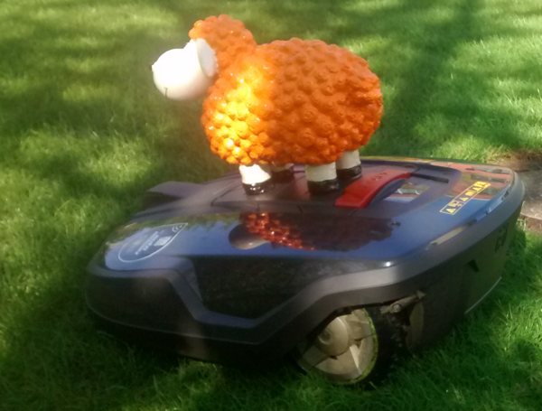

# Text

<iframe src="https://player.vimeo.com/video/787824320?h=1f73c65841&amp;badge=0&amp;autopause=0&amp;player_id=0&amp;app_id=58479" frameborder="0" allow="autoplay; fullscreen; picture-in-picture" allowfullscreen style="position:absolute;top:0;left:0;width:100%;height:100%;" title="openHPI-guidelines-14-text"></iframe>

All reading material of the course can be carried out in three different formats: 

 - directly as a text page
 - as a PDF download
 - as a web link

To be properly displayed in mobile apps, text pages cannot contain other formatting options than markdown.
Although HTML is allowed to be used for particular purposes, we strongly discourage its use as it will not be rendered but shown as source code in the mobile apps.
  
Next to simple formatting options such as headlines, bold and italic text, lists, etc., the supported markdown allows to include images and links to download files, create weblinks, and insert tables. 

Icon type:
You can select different icon types from the icon type dropdown to be shown to the participants in the item menu.

From left to right: 

- Assistant
- Chart
- Discussion
- Exercise
- External video
- Moderator icon
- Team exercise icon
- Youtube video icon

If no particular icon is chosen, the item will be displayed with a generic text icon

# Some Markdown examples

## Headlines

# H1  `# H1`

## H2 `## H2`

### H3 `### H3`

#### H4 `#### H4`

##### H5 `##### H5`

###### H6 `###### H6`

## Paragraph and Linebreaks

I am a 

paragraph (Add two "linebreaks" at the end of the line)

I am a (forced)  
Linebreak (Add two "spaces" at the end of the line before the linebreak)

I am 
nothing (Just a simple linebreak)

## Horizontal lines

---
A line can be created by three consecutive minus signs (-).

## Lists

 - I 
 - am 
    - an 
    - unordered
 - List 

` - I` (space + minus sign)  
` - am` (space + minus sign)  
&nbsp;&nbsp;&nbsp;`- an`  (Add additional spaces to create hierarchy levels)  
&nbsp;&nbsp;&nbsp;` - unordered`   
` - List` (Or remove them again to jump back to the higher hierarchy level) 

 

 1. I 
 2. am  
    a. an  
    b. ordered 
 3. List 

` 1. I` (space + 1.)  
` 2. am` (space + 2.)  
&nbsp;&nbsp;&nbsp;`a. an`  (Add additional spaces to create hierarchy levels)  
&nbsp;&nbsp;&nbsp;`b. ordered`   
` 3. List` (Or remove them again to jump back to the higher hierarchy level) 

Lists with nested hierarchy levels can become tricky. If necessary, experiment with the proper amount of spaces. Make sure to add a paragraph (two line breaks) before and after a list.

## Links

The best way to add links is by using the link tool in the tool bar.
Complete URLs within the text will also be automatically transformed into clickable links. However, their behaviour might differ to the ones that are created explicitely (e.g. they do not open a new tab/window)

Here is the [HPI][1].

Explicitely created links consist of two components:  

 1. Call the link in the text  
\[HPI\]\[1\]

 2. Define the link url at the end of the text (this is not visible in the rendered version)  
  \[1\]\: https://www.google.de/maps/place/Hasso+Plattner+Institute/@52.3939998,13.1311717,17z/data=!3m1!4b1!4m5!3m4!1s0x47a85f365d286349:0x1da4e14975e45e72!8m2!3d52.3939965!4d13.1333657

## Bilder

Images are first uploaded using the drop area on the right and are then available in the context of the current text page via the "Insert image" button. Uploaded images are only persisted when the image has actually been integrated into the text. Unused images will be deleted from the server sooner or later.

Images are inserted using the image selector in the toolbar of the text area.

The inserted image will be displayed in the text as follows:    
\!\[enter image description here]\[1]

The text in the square brackets :   
"enter image description here"  
has to be replaced by a proper alt-text to allow e.g. screen readers to access the image.  
\!\[Plastikschaf auf Rasenmähroboter]\[1]

## Downloads

Other file formats that are to be made available for download are included the same way as the images.

![enter image description here][4]   
\!\[enter image description here\]\[4]

Im Nachgang muss das `!` vor den eckigen Klammern entfernt werden und ein vernünftiger Text zur Beschriftung des Download-Links eingefügt werden.
However, including the link to the file in the text, the `!` in front of the square brackets must be removed and a proper text must be inserted to label the download link.

[Download][4]  
\[Download]\[4]

## Tables

|Month|Savings|Spending|
|--- |--- |--- |
|January|$100|$900|
|July|$750|$1000|
|December|$250|$300|
|April|$400|$700|

\|Month|Savings|Spending|  
|- - - |- - - |- - - |  (Spaces have been added for better readability)   
|January|$100|$900|  
|July|$750|$1000|  
|December|$250|$300|  
|April|$400|$700|  

To use more complex Markdown tables, we recommend  to work with a [Converter][5].

  [1]: https://www.google.de/maps/place/Hasso+Plattner+Institute/@52.3939998,13.1311717,17z/data=!3m1!4b1!4m5!3m4!1s0x47a85f365d286349:0x1da4e14975e45e72!8m2!3d52.3939965!4d13.1333657
  [3]: ../../../img/courseadministration/items/dolly.png
  [4]: ../../../img/courseadministration/items/1_UploadTest-Ludwigshafen.pdf
  [5]: https://jmalarcon.github.io/markdowntables/

