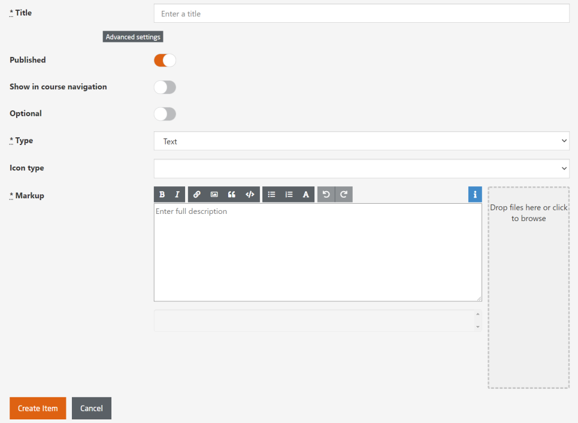

# Type Text

The provision of reading material can be generally carried out in three forms: 

 - directly as a text-page, 
 - as a PDF download, or 
 - as a web link

<iframe src="https://player.vimeo.com/video/787824320?h=1f73c65841&amp;badge=0&amp;autopause=0&amp;player_id=0&amp;app_id=58479" frameborder="0" allow="autoplay; fullscreen; picture-in-picture" allowfullscreen style="position:absolute;top:0;left:0;width:100%;height:100%;" title="openHPI-guidelines-14-text"></iframe>

To create a text item, first select `Course Structure & Content`  

  

  
*Fig. Select Text as the type and fill up the rest of the compulsory fields*  
 

To be properly displayed in the mobile apps, text pages cannot contain other formatting options than markdown.
Although HTML is allowed to be used for particular purposes, we strongly discourage its use as it will not be rendered but shown as source code in the mobile apps.
  
Next to simple formatting options such as headlines, bold and italic text, lists, etc., the supported markdown allows to include images and links to download files, create weblinks, and insert tables. 

To link a file for download:

- Upload the file via the file upload drop zone next to the text input field.
- Click on the add image icon and select the file that you have just uploaded.
- In the text field: **remove** the "!" in front of the download link and add some meaningful text within the brackets

Icon type:

*Fig. Manipulate image link to turn it into a download link*

