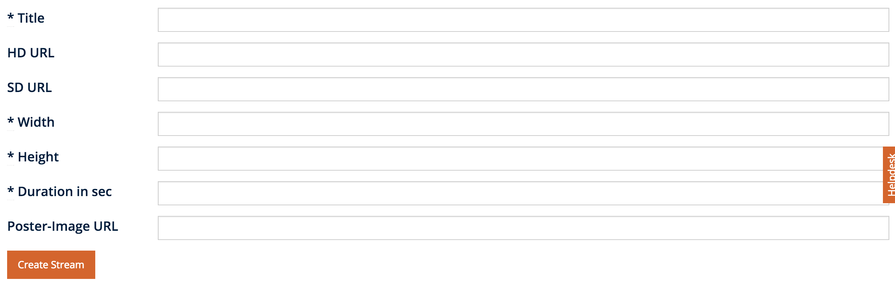
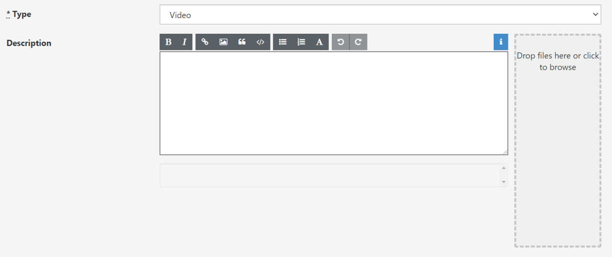
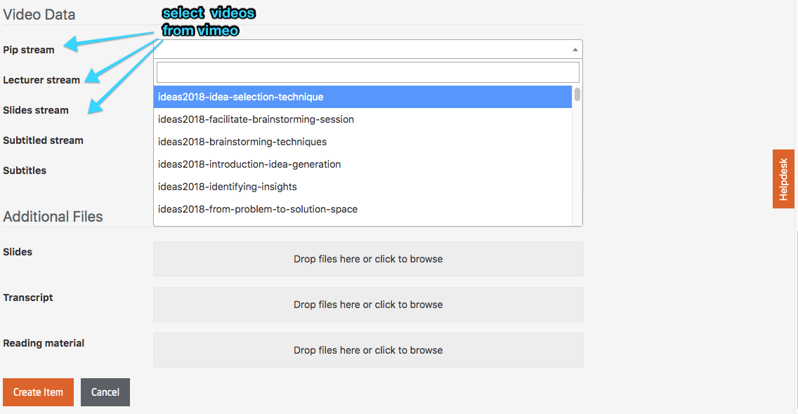

# Type Video

>The workflow of video production and post production, in terms of allocation of videos, can be carried out in different ways and therefore will not be discussed further in this document. Instead, we assume that you already have a produced video at hand, which you want to bring to the platform or you can take the assistance from the Medientechnik team.

**Integrating videos hosted on Vimeo:**
The integration for the Vimeo API from within the platform is sufficiently good. 
Basically there is a Vimeo Pro account that exists for the platform, from which videos are delivered. The streams can be uploaded from within the platform to Vimeo. See also [Uploading videos to Vimeo](https://vimeo.zendesk.com/hc/en-us/categories/201496018-Uploading-to-Vimeo).  
The filenames of the streams should begin with the course code of the course. Please note that the system is case sensitive. As soon as one stream with the course code prefix is available, only those streams that start with the course code prefix will be listed in the drop-downs automatically. To add a video with a different prefix to a course, you can start typing that prefix then all videos with that prefix will be listed.
The platform's database is synchronized with Vimeo on a daily basis. See also below: [*Synchronize streams with vimeo*](https://teachingteamguidelines.readthedocs.io/05_adding-content.md#L217)

**Integrating videos hosted by other providers:**
API support for other providers is currently not supported.
Platform admins (not teachers or teaching team members), however, can manually add video streams that are hosted with other providers. 

*Add stream form (Administration => Videos)*

**Title:** The title of the streams should begin with the course's course\_code. Please note that the system operates case sensitive here. As soon as one stream with the course\_code prefix is available, only those streams that start with the course\_code prefix will be listed in the dropdowns.

**HD / SD URL:** The location where the respective strream can be found on the server.

**Width / Height:** The size of the video.

**Duration:** The length of the video.

**Poster-image URL:** Set a custom poster image (will be displayed before the video is started) for the video.

**PIP stream, Lecturer stream, and Slides stream:**  
All videos can be integrated via a dropdown menu directly using the Vimeo API. In case the appropriate videos are named according to the specification above (name begins with abbreviation), only the course relevant videos will be listed in the dropdown menu. Videos that are not named in respect to this convention will not be listed. The platform must be synchronized with Vimeo once again, when a video's title has been changed there.

 - The steps listed above must be executed for the PIP stream (Picture in Picture) as well as the teacher and desktop stream, should all possibilities be offered.
 - It is possible to offer only the PIP stream if the videos have not been recorded with the tele-TASK system.
 - If all three streams are provided the PIP stream serves as a fall-back solution for devices that are not able to cope with our dual stream player.
 - PIP stream is useful specially for handheld devices like smartphone, tablet etc.

**Description:** When implementing video items on the openHPI Platform additional further information (such as introductory remarks or errata) can be added to the video on top or below the video items.

**Thumbnail archive:** This only applies if you have access to a full fledged tele-TASK system. In this case you also have access to web tool that generates these thumbnail archives.
 
**Subtitles:**  Can be provided in WebVTT format.

	WEBVTT

	00:00:03.500 --> 00:00:05.000
	Ein männlicher Briefmark erlebte

	00:00:06.000 --> 00:00:09.000
	Was Schönes, bevor er klebte.

	00:00:11.000 --> 00:00:14.000
	Er war von einer Prinzessin beleckt.
	
If subtitles are to be provided in multiple languages, all the filenames have to be extended with a short-form for the language:

	video-subtitles.vtt => video-subtitles.de.vtt
	
All the vtt files will have to be added to the same directory, which then can be zipped and uploaded here.  
Subtitles can also be generated from external agencies like poliTrans (MLLP) or Amazon (AWS) etc.

**Slides:** The slide sets can be provided as a PDF download, just like normal reading material. Slides to the videos should be added directly to the video item. Collected slide sets additionally can be made available to download on the 'materials' web page. For mobile apps, only the slides that have been provided with the video item will be included.

**Transcript:** A pdf with the transcript of the video content can be added here. It will be available for the users to download on the video page.

**Reading material:** You can add additional reading material in pdf format here.

**Audio:** For the optional provision of separate audio tracks for the videos. Audio streams can easily be produced with the ffmpeg tool. It is also available for download.

**Synchronize streams with Vimeo:** Streams are synchronized with Vimeo on a daily basis. If you want to add a Vimeo stream that has been uploaded to Vimeo more recently, you might have to synchronize the platform with Vimeo.

*Create new video item form* 

