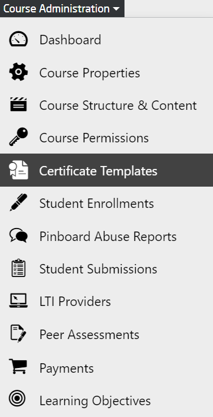
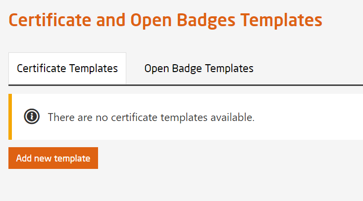
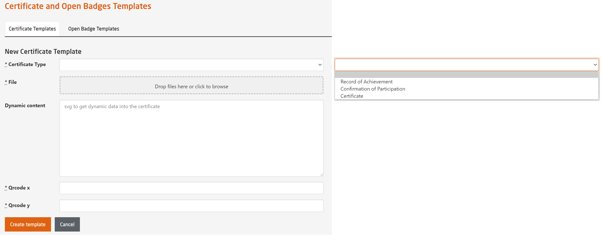

# Certificate Templates

Course administrators have the permission to create a new certificate template or edit an already prepared template.  

  
*Fig. To create or edit certificate template*  
 

  
*Fig. To add a new certificate template*  
 

  
*Fig. To create a new certificate template based on the certificate type of choice*  
 

Course administrator can add up to three different types of certificates:  

* Qualified Certificate:  
  The template should contain the following information -  
  * Participant's name
  * Participant's e-mail address
  * Participant's verified picture (through automatic face recognition)
  * Date of birth (optional)
  * Course title and summary
  * Credits earned
  * Course performance (if you're among the top 5%, 10%, or 20% of participants)
  * Signature of the Head of openHPI and course instructors
  * Anti-counterfeit link and QR code
  * Current date  
   
    
*Fig. Preview of Qualified Certificate*  
 

* Record of Achievement:  
  The template should contain the following information -  
  * Participant's name
  * Participant's e-mail address
  * Date of birth (optional)
  * Course title and summary
  * Credits earned
  * Course performance (if you're among the top 5%, 10%, or 20% of participants)
  * Signature of the Head of openHPI and course instructors
  * Current Date
  * Anti-counterfeit link and QR code  
   
    
*Fig. Preview of Record of Achievement*  
 

* Confirmation of Participation:  
  The template should contain the following information -  
  * Participant's name
  * Participant's e-mail address
  * Date of birth (optional)
  * Course title and summary
  * Current date  
   
    
*Fig. Preview of Confirmation of Participation*  