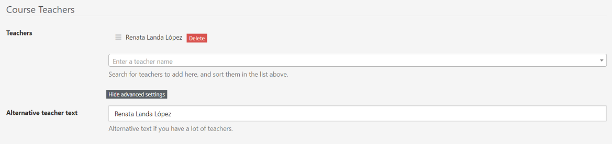
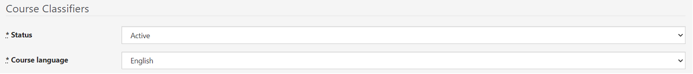
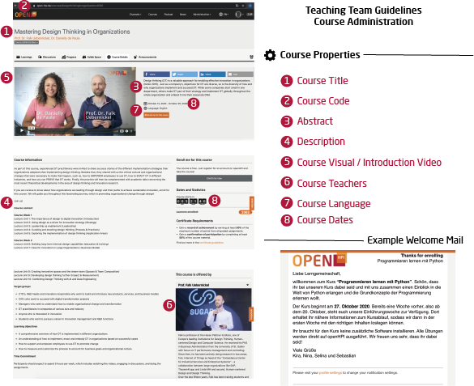
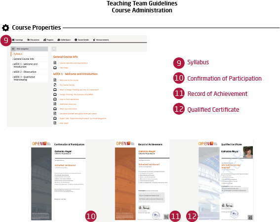

# Course properties

The course itself will be generated by the platform administrator. You will have to complete a few settings, however. Platform admins or course admins can edit the course properties under the course administration menu.  

## Metadata

<iframe src="https://player.vimeo.com/video/773675861?h=ad6433104f&amp;badge=0&amp;autopause=0&amp;player_id=0&amp;app_id=58479" frameborder="0" allow="autoplay; fullscreen; picture-in-picture" allowfullscreen style="position:absolute;top:0;left:0;width:100%;height:100%;" title="openHPI guidelines | 02 Course properties | Metadata"></iframe>

#### Title
You can change the course title anytime you want. You should, however, stick to the chosen title as soon as the course has been published or announced.

#### Course Code
The course code will be visible to the participants in the course's URL.
Apart from that it only serves for internal purposes and **cannot** be changed anymore later on as some features rely on it, for instance the automatic filtering of the course videos for the video item dropdown.

### Content language
Within the course list, the course could be also filtered by the chosen course language.

### External course URL
Usually you just should keep it as it is. The platform team will make the correct settings. This is only for cross-promoting courses from sister-platforms such as *openHPI* or *openSAP*.

#### Abstract

The abstract is shown on the course list, title page, and the user's dashboard.	
It will include: 	
  - a brief information about the course schedule, 	
  - the language of the course, 	
  - the duration, 	
  - and a link to either enrol/un-enrol or enter the course.	

#### Description
The description shows the course content, learning objectives and target audience in more detail. 	
It should include:	
  - a brief summary of the course,	
  - the goal of the course along with an explanation about how it can be applied later,	
  - the structure of the course, explaining briefly about each week's expectation,	
  - the target audience and workload, including the time required to finish the course.	
  - short details about the course instructor,	
  - exam & certification details along with requirements for achievement.

## Visuals

### Image
The course image is shown in the course list and course details view. Please add an image, which is related to the content. 
Ideally, the image is free of copyrights, alternatively images under a Creative Commons license or stock photos from commercial providers can be used. In these cases the license has to be provided in the course description.

### Introduction video
A short teaser video (maximum 90 seconds) is required to be published a month prior to releasing the course. The video needs to highlight important information about the course and to motivate interested participants to enrol.  

## Teachers

This is only for display reasons and does not provide any rights to the users that are added here. Only users that have been promoted to teachers beforehand can be added here. 

Please contact a platform administrator to promote a user to a teacher.

If a large amount of teachers will be conducting the course, you can provide an alternative teacher text, which will be shown instead of an extensively long list of teachers. Therefore you have to click on the "Advanced Settings" button to expand the alternative teacher text option.  

## Categorization

### Topic

### Reporting Type

### Course List

### Level

### Learning goals

### Target groups

### Channel
If you want to publish your course in a dedicated channel, you can select the channel here by using the dropdown.

### Advanced settings

In the advanced setting you can find also the option to highlight the course on the channel stage, selecting the status "Show on stage". Choosing this, it is mandatory to add a stage visual and a statement.

## Runtime and visibility

Your course will be classified by two characteristics within the course list: Status and Course Language. 

### Status
The status describes, which mode your course is currently in. You can choose between the following:

- **Preparation:** Use this while you're preparing the course. In this state the course is not visible to regular users; only to admins, teaching team members and teachers of the course.
- **Active:** This is the setting to be chosen while the course is running. It can be set anytime before the start of the course, as soon as you want your users to see it. It does not necessarily have to be completed. As long as there is no content available, users will only be able to access the course's details page. Please make sure to have completed the settings as described here before activating the course.
- **Archive:** When the course is finished it will automatically fall into archive mode. 

### Auto archive after course end
Leave the setting as it is if you do not know exactly what you're doing

### Course is hidden
You can use this setting to hide a course from the course list. Can be used for old iterations of a course to keep the course list tidy, or for experiments. The course is completely functionable and accessible for whoever knows the direct URL.

### Show on course list

When disabled, the course will not show up on the global course list. It will, however, still be listed on its channel's landing page.

### Restricted to groups

### Start date (UTC)
The "actual" start date of the course.

### Displayed start date
The "official" start date of the course. If set, it allows to make some part of the contents available as a preview.

### End date
The end date of the course.

## Enrollment

### Welcome Mail
A custom text can be written here that will be sent to all the participants enrolling in the course.  
Here is a sample text:

    Dear Course participant,

    Thank you for enrolling in our openHPI course "TITLE" and for joining our learning community. We are happy about your interest in this exciting topic and are  
    looking forward to vibrant discussions in the forum.  
   
    Before the course starts on DATE we will keep you updated on all new content. Please stay tuned for any further messages. To make sure that you will receive them please
    check your Event Notifications (LINK) section.

    Kind regards,   

    We hope you will enjoy the course.

    Course Instructor's Name
    
### Require invitation
This feature can be used if you do not want the participants to enrol directly by themselves. The enrolment would be on the basis of invitation, for example, by sending the link to the course to a small group of participants and whosoever knows the URL can enrol for the said course.

### Policy URL

    
## Features

### Overview
Show an overview of all published course content in the learning area.

### Video / audio download
All video or audio sequence can be downloaded by the participants if wished. This enables the participants to learn, for example, when no access to the internet is possible.

### Collab spaces
Collab spaces offer smaller groups within a course the possibility to work together or to communicate without the whole course population knowing their shared information. Every course participant is able to create a collab space. All course participants can enter an open collab space. With a closed collab space, participants need to first apply for member- ship to gain entry. 

## Certificates 
For completing the course, participants could get the opportunity to receive a certificate. There are three certificate options:

### Confirmation of Participation
You are eligible for a Confirmation of Participation if you have visited at least 50 percent of the course material. The Confirmation of Participation contains the following information: Name of participant, date of birth (optional), course title and summary

### Record of Achievement
You are eligible for a Record of Achievement if you have earned more than 50 percent of the available points in the weekly assignments and the final exam. The Record of Achievement contains the following information:

* Participant's name
* Date of birth (optional)
* Course title and summary
* Credits earned
* Course performance (if you're among the top 5%, 10%, or 20% of participants)
* Anti-counterfeit link and QR code

### Certificate (Proctoring)
A Qualified Certificate contains the participant’s photo and a supplement with detailed course information. The participant agrees to be proctored via webcam during the graded exercises and exams. With the help of this online proctoring technology, we determine that the registered user is taking the assignments and the final exam in person.

Besides the photo, the Qualified Certificate contains the following information:

* Participant's name
* Date of birth (optional)
* Course title and summary
* Credits earned
* Course performance (information about whether the participant is part of the best 5%, 10% or 20% of all participants)
* Anti-counterfeit link and QR code

### Reactivation
Allows achieving a RoA after regular course runtime (when graded assignments are locked). Learners have to book this feature by redeeming a voucher.

## Statistics

### Enrollment delta
### Auto-calculate course middle
### Course middle for stats (UTC)
### Rating (average stars)
### Rating (number of votes)

## End of course

### Release records
**Release Records:** As soon as your records (record of achievement, confirmation of participation) are ready to be released, turn this on.
*Prerequisites:*

- Record templates have been added (see [here](todo://link)).
- Statistics have been generated (see below).

### Lock forum
If you want to lock the forum when the course goes to archive mode, you can set that here. In general, we recommend to do that if no one is keeping an eye on the forum anymore.

### Generate Ranking
As soon as all deadlines have passed and all re-gradings have been done, press this button. You will receive an (in-platform) notification when it's done (takes some seconds). This button calculates only the value for *top X* for each user. This, in general, is required before the certificates can be released.

  
*Fig. Preview of the course properties*
