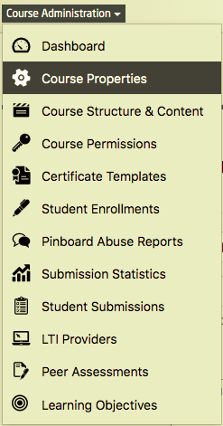

# Setting up the course's properties

The course itself will be generated by the platform ops team.

You will have to complete a few settings, however.

Platform admins or course admins can edit the course's properties under the course administration menu.  

*Fig. 01: Course Administration* => *Course properties*

## Course Title
You can change the course title anytime you want. You should, however, stick to the chosen title as soon as the course has been published or announced.

## Course Code
The course code will be visible to the participants in the course's URL.
Apart from that it only serves for internal purposes and should not be changed anymore later on as some features relies on it, for instance the automatic filtering of the course videos for the video item dropdown.

## Abstract and Description

- **Abstract** 
The abstract is shown on the course list, title page, and the user's dashboard.
It will include: 
  - a brief information about the course schedule, 
  - the language of the course, 
  - the duration, 
  - and a link to either enrol/un-enrol or enter the course.

- **Description**
The description shows the course content and execution in more detail. 
It should include:
  - a brief summary of the course,
  - the goal of the course along with an explanation about how it can be applied later,
  - the structure of the course, explaining briefly about each week's expectation,
  - the target audience and workload, including the time required to finish the course.
  - short details about the course instructor,
  - exam & certification details along with requirements for achievement.

  
## Course visual and introduction video

The course visual is shown in the the course list and course details view. Please add an image, which is related to the content. 
A short teaser video (maximum 90 seconds) is required to be published a month prior to releasing the course. The video needs to highlight important information about the course and to motivate interested participants to enrol.

## Course Teachers

This is only for display reasons and does not provide any rights to the users that are added here. Only users that have been promoted to teachers beforehand can be added here. 

Please contact a platform administrator to promote a user to a teacher.

If a large amount of teachers will be conducting the course, you can provide an alternative teacher text, which will be shown instead of an extensively long list of teachers. Therefore you have to click on the "Advanced Settings" button to expand the alternative teacher text option.

## Course Classifiers

Your course will be classified by two characteristica within the course list: Status and Course Language. 

**Status**
The status describes, which mode your course is currently in. You can choose between the following:

- **Preparation:** Use this while you're preparing the course. In this state the course is not visible to regular users; only to admins, teaching team members and teachers of the course.
- **Active:** This is the setting to be chosen while the course is running. It can be set anytime before the start of the course, as soon as you want your users to see it. It does not necessarily have to be completed. As long as there is no content available, users will only be able to access the course's details page. Please make sure to have completed the settings as described here before activating the course.
- **Archive:** When the course is finished it will automatically fall into archive mode. 

**Course language**
Within the course list, the course could be also filtered by the chosen course language.  

By expanding the avanced settings you will also find the following course classifiers:

**Categories** 
Create or select any category that fits your purpose. The categories will be used for filtering in the courses list.

**Reporting Type**

**Enrollment Delta**

**Skills**

## Channel Setting

**Channel**
If you want to publish your course in a dedicated channel, you can select the channel here by using the dropdown.

In the advanced setting you can find also the option to highlight the course on the channel stage, selecting the status "Show on stage". Chosing this, it is mandatory to add a stage visual and a statement.  

## Course dates

**Start date:** The "actual" start date of the course.

**Displayed start date:** The "official" start date of the course. If set, it allows to make some part of the contents available as a preview.

**End date:** The end date of the course.

## Course Certificates 
For completing the course, particpants could get the opportunity to receive a certificate. There are three certificate options: 

**Offer Record of Achievement**
You are eligible for a Record of Achievement if you have earned more than 50 percent of the available points in the weekly assignments and the final exam. The Record of Achievement contains the following information:

Participant's name
Date of birth (optional)
Course title and summary
Credits earned
Course performance (if you're among the top 5%, 10%, or 20% of participants)
Anti-counterfeit link and QR code

**Offer Confirmation of Participation**
You are eligible for a Confirmation of Participation if you have visited at least 50 percent of the course material. The Confirmation of Participation contains the following information: Name of participant, date of birth (optional), course title and summary

**Release Records:** As soon as your records (record of achievement, confirmation of participation) are ready to be released, turn this on.
*Prerequisites:*

- Record templates have been added (see [here](todo://link)).
- Statistics have been generated (see below).

**Exam is proctored (Qualified Certificate)**
A Qualified Certificate contains the participant’s photo and a supplement with detailed course information. The participant agrees to be proctored via webcam during the graded exercises and exams. With the help of this online proctoring technology, we determine that the registered user is taking the assignments and the final exam in person.

Besides the photo, the Qualified Certificate contains the following information:

Participant's name
Date of birth (optional)
Course title and summary
Credits earned
Course performance (information about whether the participant is part of the best 5%, 10% or 20% of all participants)
Anti-counterfeit link and QR code

## Advanced settings

**Welcomemail**

A custom text can be written here that will be sent to all the participants enrolling in the course.  
Here is a sample text:
    
    Dear Participants,

    Thank you for your interest in <course name>. 
    Mention what the audience will learn from the course, what can be expected and so on.

    Mention the criteria for the exams and certificates (if any).

    I hope you will enjoy the course.

    Course Instructor's Name

**Further Advanced Settings** (klick to expand)

**External course URL and External course delay:** Usually you just should keep it as it is. The platform team will make the correct settings. This is only for cross-promoting courses from sister-platforms such as *openHPI* or *openSAP*.

**Has collab space**
Collab spaces offer smaller groups within a course the possibility to work together or to communicate without the whole course population knowing their shared information. Every course participant is able to create a collab space. All course participants can enter an open collab space. With a closed collab space, participants need to first apply for member- ship to gain entry. 

**Forum is locked:** If you want to lock the forum when the course goes to archive mode, you can set that here. In general, we recommend to do that if no one is keeping an eye on the forum anymore.

**Restricted to groups**

**Enable video/audio download** All video or audio sequence can be downloaded by the participants if wished. This enables the participants to learn, for example, when no access to the internet is possible.

**Course is hidden:** You can use this setting to hide a course from the course list. Can be used for old iterations of a course to keep the course list tidy, or for experiments. The course is completely functionable and accessible for whoever knows the direct URL.
 
**Invitation required:** This feature can be used if you do not want the participants to enrol directly by themselves. The enrolment would be on the basis of invitation, for example, by sending the link to the course to a small group of participants and whosoever knows the URL can enrol for the said course.

**Show Syllabus:** This should be generally turned on. If you do not want to show a syllabus page (listing of all the course contents), turn it off.

**Auto archive after course end:** Leave the setting as it is if you do not know exactly what you're doing

**Generate Ranking:** As soon as all deadlines have passed and all re-gradings have been done, press this button. You will receive an (in-platform) notification when it's done (takes some seconds). This button calculates only the value for *top X* for each user. This, in general, is required before the certificates can be released.

