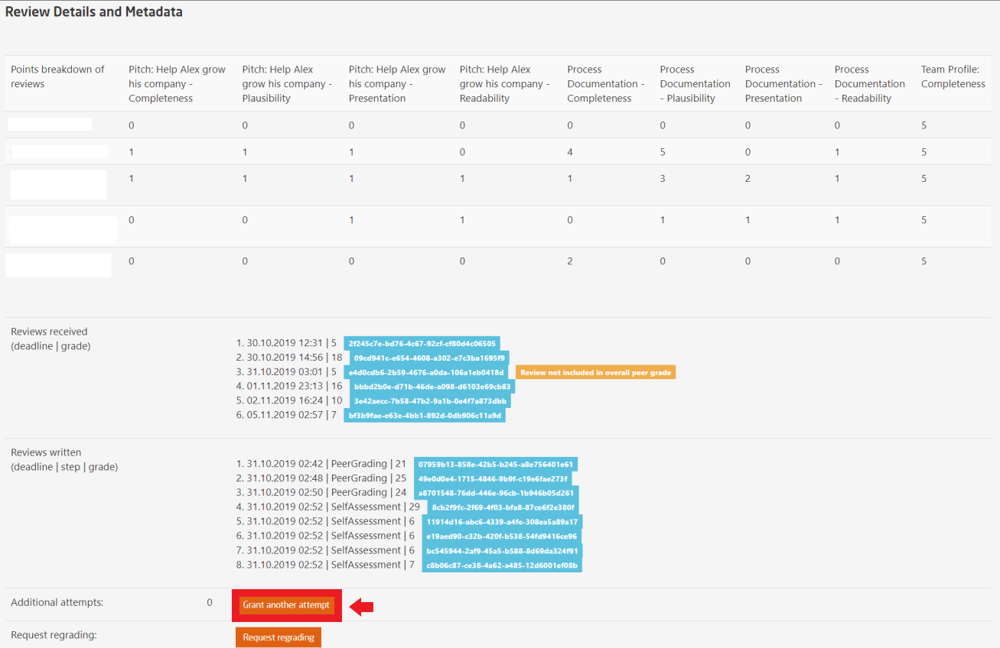
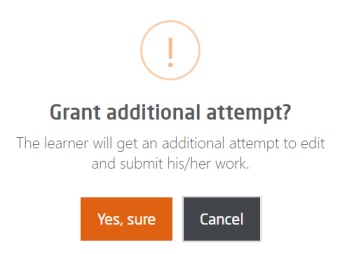

# Peer Assessment Additional Attempts

Teaching staff can grant participants an additional attempt by following the illustrations mentioned below: 

  

  
*Fig. In this page, you can manage all the submitted peer assessments*  
   

  
*Fig. View the submission and peer reviews along with your rating for the participant's work*  
   
At the bottom of the same page as shown above, teaching staff will get the option to add another attempt as illustrated below:  

  
*Fig. View the review details and facility for granting another attempt*  

  
*Fig. Confirm to an additional attempt*  
 
It is advisable to consult the administration before granting another attempt.

