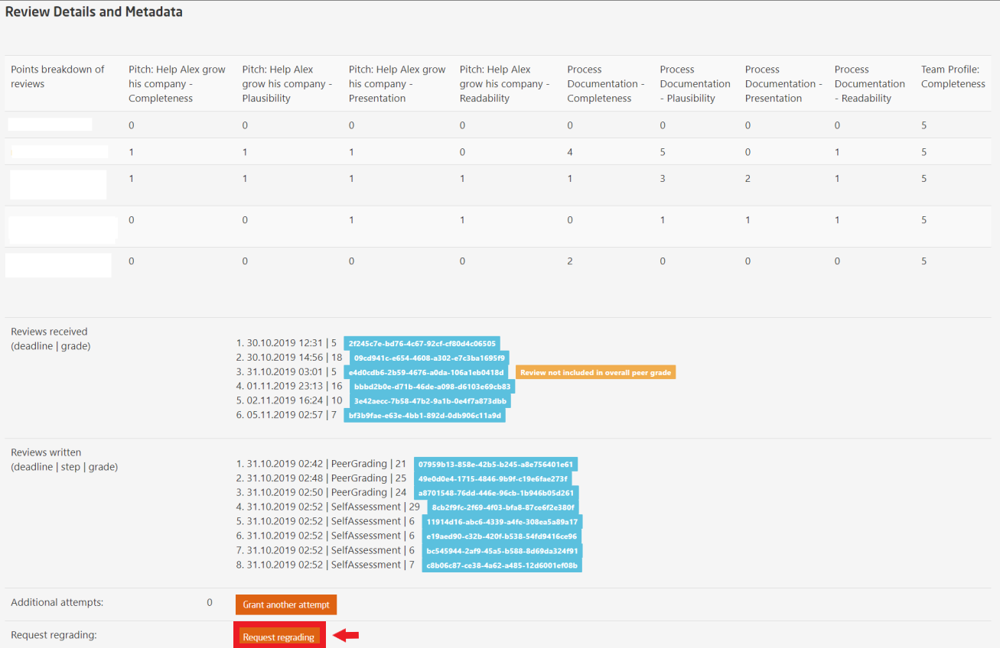
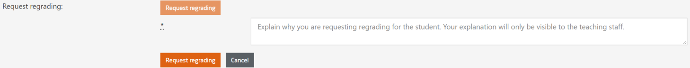

# Peer Assessment Conflicts & Regrading

If any reviewer reports a complaint against the reviewed participant, you can manage the details and resolve the conflict by following the illustration:  

  
  
*Fig. In this page, you can see all conflicts reported by the reviewers and reviewed participants along with a brief subject mentioning the reason for conflict*  

For conflict reconciliation, click on **`Reconcile`** and you will be displayed the following page:  

  
*Fig. In this page, you see the details of the reported conflict along with the reviewer and reviewed participant(s).*  
   
  
*Fig. In the same page down below, the teaching team can add a note and in some cases adjust the grade to close the conflict.*  
 
If you choose to check the **Delta is absolute** box -  
* The grade will be set to a fixed amount of points
* Reviewer median and bonus points will be ignored  

If you choose to set a delta value, the points will be applied on top of the overall grade.  

# Regrading  

Teaching staff have the option to request for regrading any participant's peer assessment in either the **Conflict Reconciliation** page or the **Peer Assessment Submission** page.  

As the former is already described above, the following illustration will show the latter.  

  
*Fig. Click the Request regrading option to request for a regrading*  
 

  
*Fig. Explain briefly for the reason to regrade*

