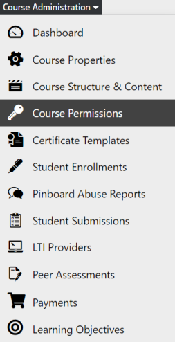

# Granting permissions

Platform and course administrators can grant permissions to a user under the course administration menu for a specific course.  

  
*Fig. Select the Course Permission from the drop-down list of Course Administration*

## Groups

### Course administrators  

All members of this group are granted the following roles and permissions:

- **User search**: find users when filtering submissions, etc.
- **Certificate administration**: add, edit and delete certificate templates, preview certificates
- **Collab space administration**: access, manage, close and delete collab spaces, manage collab space members
- **Collab space mentoring**: access team collab spaces
- **Course management**: edit course settings, manage course content, manage course permissions, view course dashboard and statistics, manage enrollments
- **Global course management**: add and edit teachers (legacy permission from former permission system)
- **Course preview**: view unpublished course content
- **QC Alert administration**: delete alerts for all users
- **QC Alerting**: list and ignore (own) alerts
- **LTI administration**: manage LTI providers
- **LTI**: use LTI providers
- **News management**: create, edit, delete and send announcements
- **Peer assessment management**: view PA settings (evaluation criteria etc.), manage submissions (view submissions/reviews/points/progress, grant additional attempts, create regrading requests), manage training samples, manage conflicts, rate and mark submissions for best-of gallery
- **Pinboard moderation**: edit, delete, block/unblock, move, close pinboard contributions, or mark them sticky, access pinboard abuse report
- **Quiz administration**: manage submissions, grant extra attempts
- **Quiz statistics**: view submission statistics
- **Quiz inspection**: view student submissions
- **Video controlling**: view video statistics
- **Subtitle editing**: upload and delete subtitles for videos
- **Peer assessment administration**: view and edit PA settings (evaluation criteria etc.), manage submissions (view submissions/reviews/points/progress, grant additional attempts, create regrading requests), manage training samples, manage conflicts, rate and mark submissions for best-of gallery, create best of gallery  

### Course moderators  

All members of this group are granted the following roles and permissions:

- **User search**: find users when filtering submissions, etc.
- **Collab space mentoring**: access team collab spaces
- **Course preview**: view unpublished course content
- **QC Alerting**: list and ignore (own) alerts
- **News preview**: view unpublished announcements
- **Pinboard moderation**: edit, delete, block/unblock, move, close pinboard contributions, or mark them sticky, access pinboard abuse report
- **Quiz inspection**: view student submissions  

### Teachers  

All members of this group are granted the following roles and permissions:

- **News preview**: view unpublished announcements
- **Pinboard moderation**: edit, delete, block/unblock, move, close pinboard contributions, or mark them sticky, access pinboard abuse report
- **Quiz statistics**: view submission statistics
- **Quiz inspection**: view student submissions
- **Video controlling**: view video statistics
- **User search**: find users when filtering submissions, etc.
- **Course preview**: view unpublished course content
- **Teacher**: legacy role for old teacher permissions
- **QC Alerting**: list and ignore (own) alerts
- **Peer assessment expert**: rate submissions, manage conflicts, manage training samples  

### Students  

All members of this group are granted the following roles and permissions:

- **Student**: basic permissions for registered and enrolled users (without special roles)