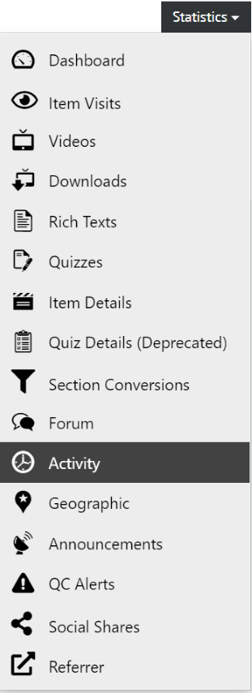
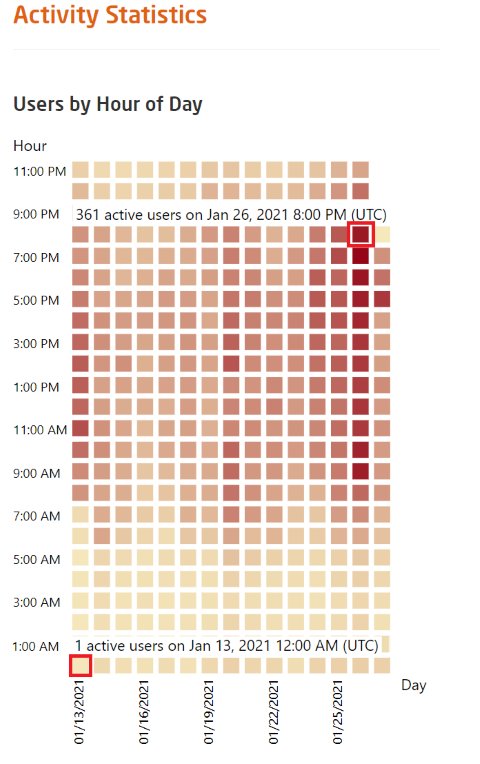

# Course Activity

All visualizations of course data can be found in the course dashboard and its more detailed sub-pages.

  
*Fig. Navigate the Dashboard button from the drop-down list under the Course Administration button*  

To get to the detailed sub-pages, you can use the statistics menu on the course dashboard.
  
*Fig. Find the Statistics button on the right hand side of the page*  

There, you'll also find the activity overview, which shows you at which days and time of the day your users have been particularly active in the course.
  
*Fig. Navigate the Activity section from the drop-down list under the Statistics button*  

The darker the color, the more active users during that time frame.

  
*Fig. Preview of the Colour-coded visualization of users' activity for a particular course*

