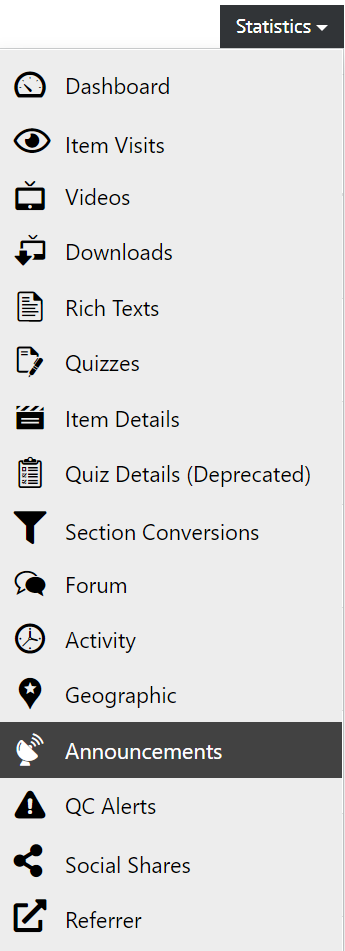
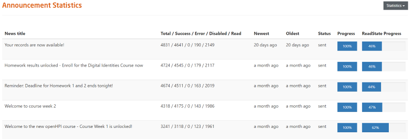

# Announcements

  
*Fig. Navigate the Dashboard button from the drop-down list under the Course Administration button*  

  
*Fig. Find the Statistics button on the right hand side of the page*  

  
*Fig. Navigate the Announcement section from the drop-down list under the Statistics button*  

This page shows the statistics of the announcements that were made for a particular course.  

  

  
*Fig. Preview of the Announcement Statistics for a particular course*  

The following headings are used to further explain the statistics as shown in the figure above:

* **News Title**: It lists all the headings of the announcements that were sent during a particular course
* **Total**: It shows the total number of announcements sent to all the participants during a particular course
* **Success**: It shows the total number of announcements that were received by participants during a particular course
* **Error**: It shows the total number of announcements that could not be sent during a particular course
* **Disabled**: It shows the total number of participants that disabled the announcement during a particular course
* **Read**: It shows the total number of announcements that were read by the users during a particular course
* **Newest** and **Oldest**: It shows the date of the announcement that were made or edited during a particular course
* **Status**: It shows the status of the announcements sent during a particular course
* **Progress**: It shows the progress of the announcements sent during a particular course
* **Read State Progress**: It shows the percentage of the users that have read the announcements sent during a particular course
