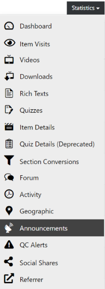

# Announcements

  
*Fig. Navigate the Dashboard button from the drop-down list under the Course Administration button*  

  
*Fig. Find the Statistics button on the right hand side of the page*  

  
*Fig. Navigate the Announcement section from the drop-down list under the Statistics button*  

This page shows the statistics of the announcements that were made for a particular course.  

  

  
*Fig. Preview of the Announcement Statistics for a particular course*  

The following headings are used to further explain the statistics as shown in the figure above:

* **News Title**: It lists all the items that were introduced in the course
* **Total**: It shows the total number of announcements made under a specific item
* **Success**: It shows the total number of successful announcements made under a specific item
* **Error**: It shows the total number of errors or retracted announcements made under a specific item
* **Disabled**: It shows the total number of announcement notifications which were disabled by the users under a specific item
* **Read**: It shows the total number of announcements that were read by the users under a specific item
* **Newest** and **Oldest**: It shows the date of the announcement that were made or edited under a specific item
* **Status**: It shows the status of the announcements made under a specific item
* **Progress**: It shows the progress of the announcements made under a specific item
* **Read State Progress**: It shows the percentage of the users that have read the announcements made under a specific item
