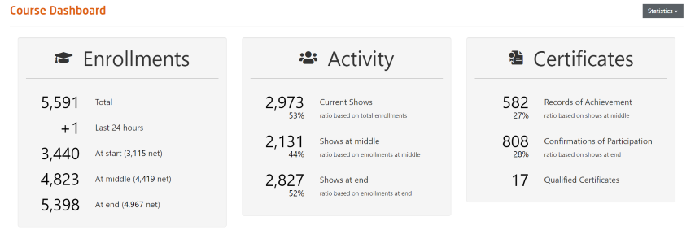
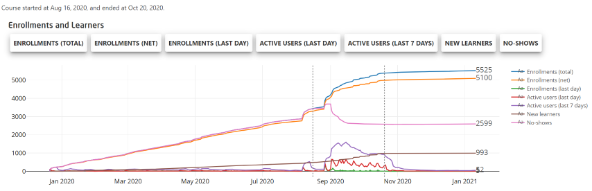
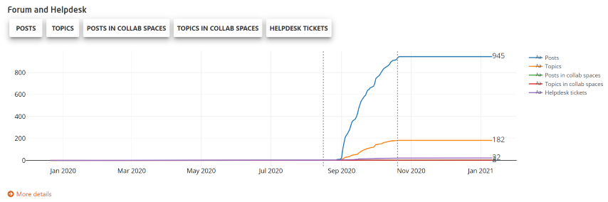

# Dashboard

  
*Fig. Navigate the Dashboard button from the drop-down list under the Course Administration button*  

In this page, course administrators and platform administrators can view the statistical details of a specific course. Each section of the dashboard shows the most significant statistics in an aggregated form. Most of the sections allow further exploration of the data by clicking the ***More Details*** button.  
   

## Enrollments, Activitys and Certificates  
This section shows the enrollment numbers at various points of time during the course, the amount of actual visitors in the course, and, once available, the numnber of issued certificates. "Shows" are the opposite of "No-Shows": enrolled participants that have opened at least one of the course items.   

  
*Fig. Sample preview of the Enrolments, Activities and Certificates details for the specific course*  

## Learning Items  
This section, shows the number of visited items, downloaded videos, and the aggregated courrse performance of the active participants within the course.

  
*Fig. Sample preview of the Learning Items details for the specific course*  

## Forum  
This section gives an overview on the forum activity in both general course forum or Collab Space forums.  

  
*Fig. Sample preview of the Forum details for the specific course*  

## Open Badges  
Open badges can be added to a course as an easily shareable alternative to course certificates (Records of Achievement only). This section provides an overview on how many of them have been issued, downloaded and shared via social media.

  
*Fig. Sample preview of the Open Badge details for the specific course*  

## Bookings  
In this section shows the number of bookings made by participants e.g. for proctored exams. 
Proctoring and other paid features are not available on all platform instances.

  
*Fig. Sample preview of the Proctoring details for the specific course*  

## Miscellaneous  
In this section, you can see the number of course alerts and the number of times the specific course was shared on Social Media. 

  
*Fig. Sample preview of the Alerts and Social sharing details for the specific course*  

## Enrollments and Learners  
This section shows how enrollments have developed over time. This is particularly interesting to evaluate your marketing activities. The view can be customized by selecting one or multiple filters found above the graph as shown in the image below:  

  
*Fig. Sample preview of the Enrollment and Participants' graphical details for the specific course*  

## Forum and Helpdesk  
This section shows how forum and helpdesk activity have developed over time. This is particularly interesting to evaluate your activities to engage users in the course, or, in case of high helpdesk acivity, might hint at conceptual problems of your course (or general internet or platform issues). The view can be customized by selecting one or multiple filters found above the graph as shown in the image below:

  
*Fig. Sample preview of the Forum and Helpdesk graphical details for the specific course*  
  
## User Location  
This section shows the geographical locations of the active users in the course. To quickly learn the number of participants for that course, hover your mouse cursor over each country. To move the map, left click on any part of the map and drag. To zoom in or zoom out a specific location, scroll your mouse wheel as per requirement.   

  
*Fig. Sample preview of the participants' geographical location details for the specific course*  

## Users by Hour, Age Distribution and Client Usage  
This section shows an aggregated activity map, the participants' age groups (this is based on data provided voluntarily in the user profile and is not available on all platforms) and a Venn diagram that shows the devices used by the participants to access the course as shown in the image below:  

  
*Fig. Sample preview of the Hourly usage, Participants' age and Device usage details for the specific course*
