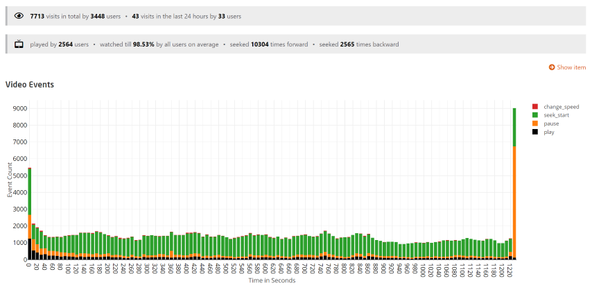

# Downloads

  
*Fig. Navigate the Dashboard button from the drop-down list under the Course Administration button*  

  
*Fig. Find the Statistics button on the right hand side of the page*

  
*Fig. Navigate the Download section from the drop-down list under the Statistics button*  

This page shows all the details pertaining to the downloads of all the video items under a specific course.  

As shown in the figure below, we use the following headings to explain the statistics:
* **Item**	- Lists all the video items in that specific course
* **Position**	- Popularity of the specific video item in that particular course
* **Total Downloads (by Unique Users)**	- Shows the total number of time a specific video was downloaded
* **HD Video Downloads (by Unique Users)**	- Shows the total number of time a specific video's High Definition version was downloaded
* **SD Video Downloads (by Unique Users)**	- Shows the total number of time a specific video's Standard Definition version was downloaded
* **HLS Video Downloads (by Unique Users)**	- Shows the total number of time a specific video's Live Streaming version was downloaded
* **Slides Downloads (by Unique Users)**	- Total number of times the slides presented in the video was downloaded
* **Audio Downloads (by Unique Users)**	- Shows the total number of time a specific video's Audio version was downloaded
* **Transcript Downloads (by Unique Users)**	- Shows the total number of time a specific video's transcript was downloaded
* **Actions** - Available action buttons

  
*Fig. Preview of the Downloads of the video assets for a particular course*  

Admins can further view the statistical details of each video items listed under a specific course as shown in the following image below:  

  
*Fig. On clicking the **More Details** button, the following page would be shown that lists all statistical details of the particular video item*  

For more information on the statistical details of the video items, please visit [Video](https://teachingteamguidelines.readthedocs.io/#features/analytics/dashboards/videos/)