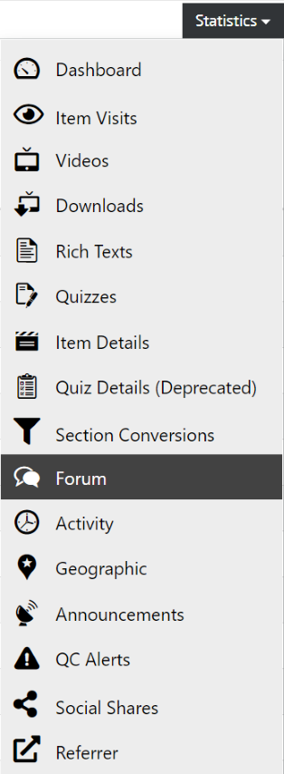
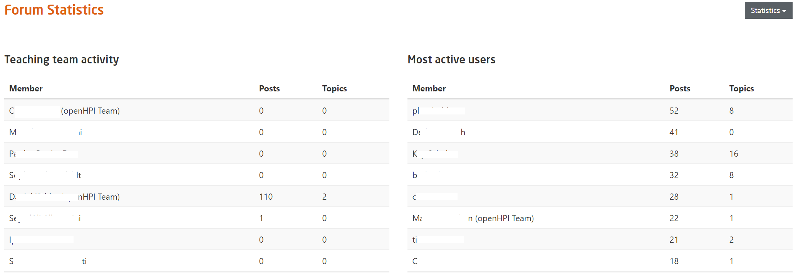

# Forum

All visualizations of course data can be found in the course dashboard and its more detailed sub-pages.

  
*Fig. Navigate the Dashboard button from the drop-down list under the Course Administration button*  

To get to the detailed sub-pages, you can use the statistics menu on the course dashboard.

  
*Fig. Find the Statistics button on the right hand side of the page*

There, you'll also find the forum overview, which shows the list of the most active forum contributors in the course.

  
*Fig. Navigate the Forum section from the drop-down list under the Statistics button*  

The list shows the forum activity of the teaching team members and the 25 most active forum contributors among the participants.
Posts in the Collab Space forums are excluded from these numbers.

  
*Fig. Preview of the Forum statistics details for a particular course*
