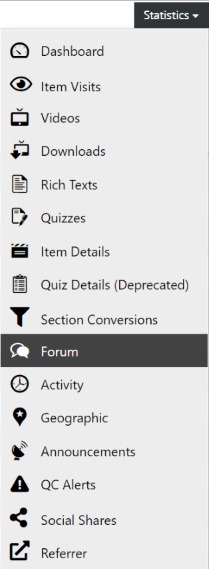

# Forum

  
*Fig. Navigate the Dashboard button from the drop-down list under the Course Administration button*  

  
*Fig. Find the Statistics button on the right hand side of the page*

  
*Fig. Navigate the Forum section from the drop-down list under the Statistics button*  

This page shows the forum statistics that lists the total number of posts made by users under different forum topics as shown in the image below. This page also lists the most active users as per their number of posts and topics they participated.

  
*Fig. Preview of the Forum statistics details for a particular course*