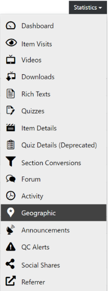

# Geography

All visualizations of course data can be found in the course dashboard and its more detailed sub-pages.

  
*Fig. Navigate the Dashboard button from the drop-down list under the Course Administration button*  

To get to the detailed sub-pages, you can use the statistics menu on the course dashboard.

  
*Fig. Find the Statistics button on the right hand side of the page*

There, you'll also find the geographic overview, which shows the list of the countries and cities (Top 100) where the users participated in the course.

  
*Fig. Navigate the Geographic section from the drop-down list under the Statistics button*  

Users are counted per location and a single user can therefore be counted at multiple locations. 
The location is determined based on the user's IP address and therefore not necessarily exact. 
The data is only available for users who have accessed at least one course item (Shows).
There is no location data available for No-Shows.

  
*Fig. Preview of the Geographic statistics details for a particular course*
