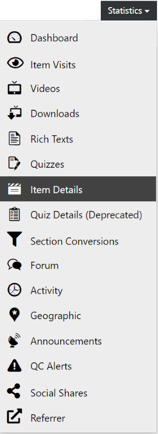
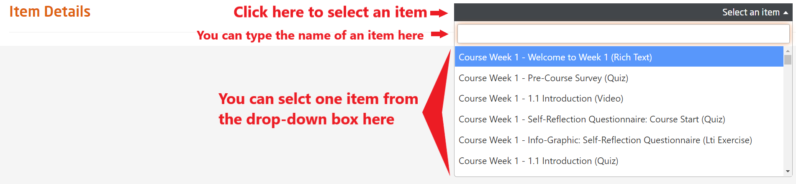
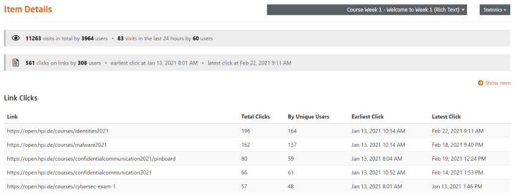
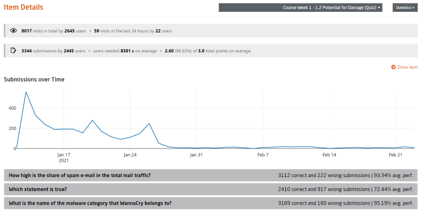
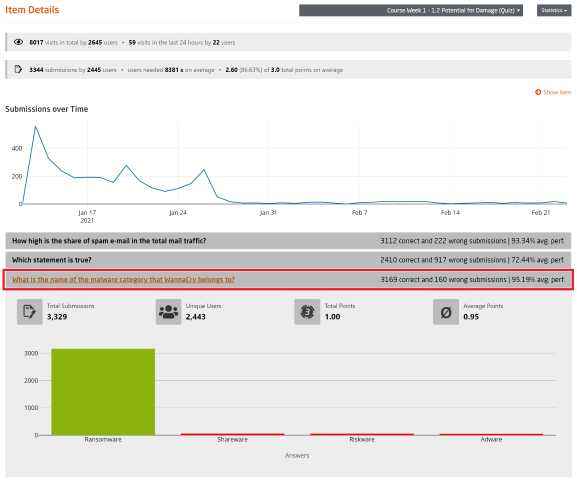

# Learning Unit Details

  
*Fig. Navigate the Dashboard button from the drop-down list under the Course Administration button*  

  
*Fig. Find the Statistics button on the right hand side of the page*

  
*Fig. Navigate the Item Details section from the drop-down list under the Statistics button*  

After selecting the **Item Details** from the drop-down list, you will be redirected to a blank Items Details page. You need to select an item from the drop-down list as illustrated in the image below:  

  
*Fig. Select one of the items from the drop-down list*  

If you select a text item then you will be redirected to the **Link Clicks** page as shown in the image below:  

  
*Fig. Details of the selected item of a particular course*  

In short, based on your item selection, you will be redirected to its respective pages.  

For example, let's select a Quiz item and check its detail page as illustrated in the following two images mentioned below:  

  
*Fig. Statistical and Graphical details of the selected item of a particular course*  

  
*Fig. Statistical and Graphical details of a specific Quiz item of the particular course*  