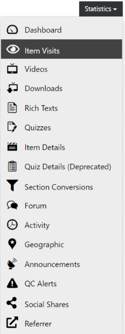

# Learning Unit (Item) Visits

All visualizations of course data can be found in the course dashboard and its more detailed sub-pages.

  
*Fig. Navigate the Dashboard button from the drop-down list under the Course Administration button*  

To get to the detailed sub-pages, you can use the statistics menu on the course dashboard.

  
*Fig. Find the Statistics button on the right hand side of the page*

There, you'll also find an overview of the numbers how often a certain item has been visited.

  
*Fig. Navigate the Item Visits section from the drop-down list under the Statistics button*  

The main information on this page is the number of visits to the page and the number of unique users that have visited the page.

  
*Fig. Details of all the items of a specific course*  
 
- **Item**	- the item's title and a direct link to the item view
- **Position**	- the exact position of the item within the course (section_nr.item_nr). This just counts sections and items and doesn't have a semantic value.
- **Content Type**	- the item's content type
- **Exercise Type**	-  the item's exercise type (empty when it is not an exercise)
- **Visits**	- the total number of visits
- **Unique Users**	- the number of unique users who have visited the item 

If you click the **More Details** button under the **Actions** as shown in the image above, you will be redirected to the **Items Details** page as shown in the image below:  

  
*Fig. Details of a specific item of a particular course*  

You can learn more about this view here: [Items Details](https://teachingteamguidelines.readthedocs.io/#features/analytics/dashboards/itemdetails/)
