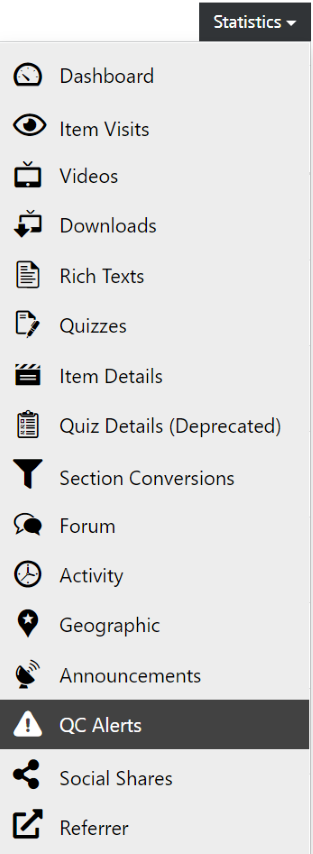
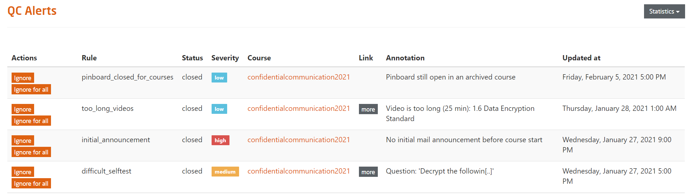

# QC Alerts

All visualizations of course data can be found in the course dashboard and its more detailed sub-pages.

  
*Fig. Navigate the Dashboard button from the drop-down list under the Course Administration button*  

To get to the detailed sub-pages, you can use the statistics menu on the course dashboard.

  
*Fig. Find the Statistics button on the right hand side of the page*

There, you'll also find an overview of the quality control (QC) alerts issued by the system.

  
*Fig. Navigate the QC Alerts section from the drop-down list under the Statistics button*  

The system issues **QC alerts** based on the **QC rules** that have been defined by the platform administrators.
QC alerts can have different severities. Some of them should necessarily be addressed for a good course experience others are rather gentle reminders to the teaching team.
 

  
*Fig. Preview of sample QC alerts of a specific course*  

- **Actions**	- QC Alerts can be ignored if the teaching team thinks decides that they are irrelevant.
- **Rule**	- the name of the QC rule that triggered the alert
- **Status**	- Status of the QC alert
- **Severity**	- Severity of the QC alert
- **Annotation**	- Short description of the QC Rule
