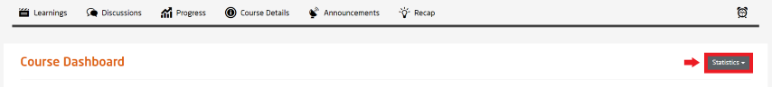
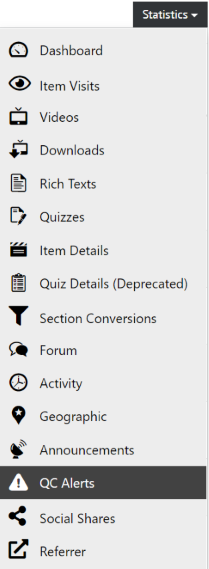

# QC Alerts

  
*Fig. Navigate the Dashboard button from the drop-down list under the Course Administration button*  

  
*Fig. Find the Statistics button on the right hand side of the page*

  
*Fig. Navigate the QC Alerts section from the drop-down list under the Statistics button*  

In this page, you can view all the QC alerts based on the **QC Rules** set by the course administrators. QC rules are a set of rules that are defined by the course administrators for their respective courses. Further details about the QC rules are mentioned in the page below.  
In the image shown below, you will find the list of QC alerts listed according to the specific QC rules along with its severity and status for a particular course.  

  
*Fig. Preview of sample QC alerts of a specific course*  

To further explain the statistics, the following headings are used as mentioned in the image above:  
- **Actions**	- Available action buttons for the specific QC rule
- **Rule**	- Lists the QC rules set for that specific course
- **Status**	- Status of the QC rule
- **Severity**	- Severity of the specific QC rule based on the number of times it was triggered
- **Course**	- Name of the course for which the QC rule was triggered
- **Link**	- Links to the specific item for which the QC rule was triggered
- **Annotation**	- Brief annotation of the specific item for which the QC rule was triggered
- **Updated at** - Latest timestamp of the action  

# QC Rules  
To find the QC Rules, click on the **Administration** button found above the page and select **QC Rules** from the drop-down list.  

  
*Fig. Navigate the QC Rules section from the drop-down list under the Administration button on top of the page*  

In this page, you will find a set of pre-defined rules that will govern all the courses available on openHPI. Course administrators can choose to turn off all the rules or select a set of rules based on their choice. If a certain event occurs, respective rules will be triggered which will be listed in the **QC Alerts** page. The rules are fairly easy to understand as shown in the image below:  

  
*Fig. Available QC Rules on openHPI*