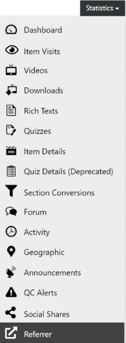

# Referrer

  
*Fig. Navigate the Dashboard button from the drop-down list under the Course Administration button*  

  
*Fig. Find the Statistics button on the right hand side of the page*

  
*Fig. Navigate the Referrer section from the drop-down list under the Statistics button*  

This page lists all the traffic sources (by URLs) that referred an user to a specific course as shown in the image below. The number of counts can be attributed to the number of visits made by an user from the referrer link.  

  
*Fig. Preview of the traffic source statistics details that were referred for a particular course*