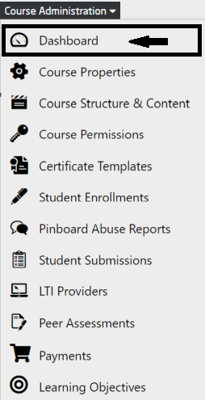
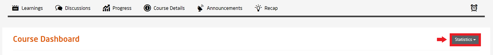
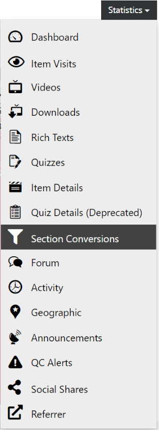
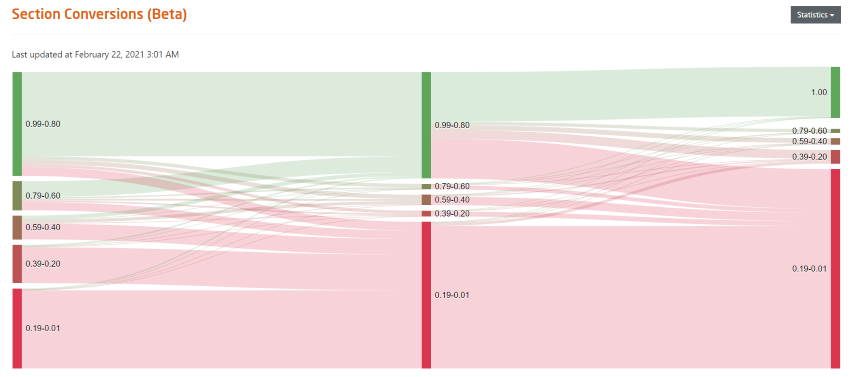
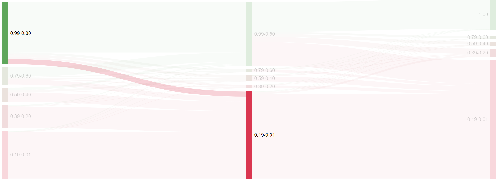

# Section Conversions

  
*Fig. Navigate the Dashboard button from the drop-down list under the Course Administration button*  

  
*Fig. Find the Statistics button on the right hand side of the page*

  
*Fig. Navigate the Section Conversion section from the drop-down list under the Statistics button*  

This feature is under beta version which shows the conversion percentage of users from one section to another. As shown in the image below, we can see the percentage of users who attended the first section (left column) and continued to the next section (right column) of a specific course.

  
*Fig. Preview of the Section conversion statistics details from one section to another for a particular course*  

From the sample image mentioned below, we can understand that the a high percentage of the users who participated in the first section (approx. 99% to 80%) dropped massively in the next section (approx. 10% to 1%).

  
*Fig. Sample percentage of users that continued their participation from the 1st section of a specific course to the next section*