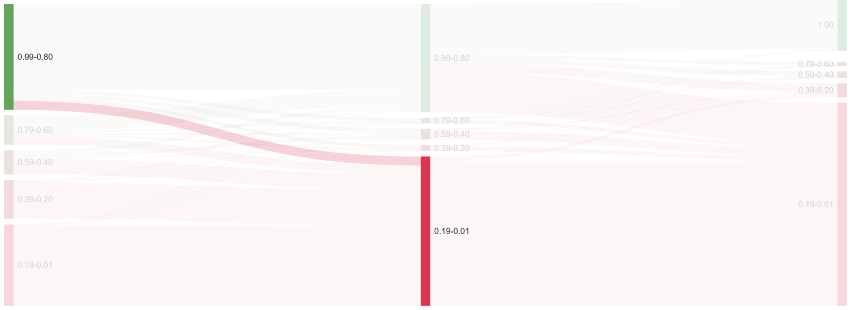

# Section Conversions

  
*Fig. Navigate the Dashboard button from the drop-down list under the Course Administration button*  

  
*Fig. Find the Statistics button on the right hand side of the page*

  
*Fig. Navigate the Section Conversion section from the drop-down list under the Statistics button*  

This feature is currently under beta version which shows the conversion percentage of users from one section to another. As shown in the image below, the percentage expresses the number of items viewed. The users are then divided into these cohorts. The number of users is therefore relatively the height of the bar. We can evaluate the transition of user density and percentage of items they visited in both sections for a specific course. Here, number of modules represent the number of sections.  

  
*Fig. Preview of the Section conversion statistics details from one section to another for a particular course*  

From the sample image mentioned below, we can see the transition of user density who visited up to 99% of the items from the first section (left column) to the next section (right column).

  
*Fig. Sample percentage of items that were visited by a particular cohort in both the sections of a specific course*