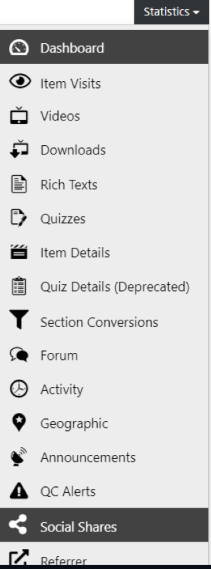
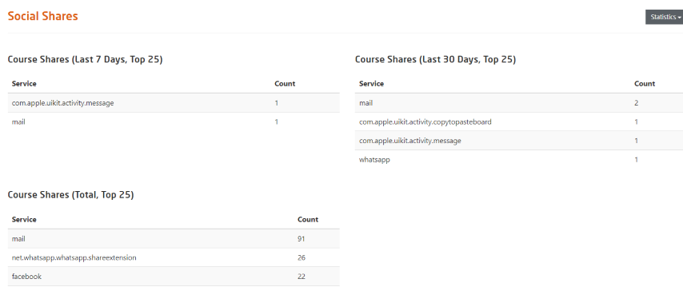

# Social Shares

  
*Fig. Navigate the Dashboard button from the drop-down list under the Course Administration button*  

  
*Fig. Find the Statistics button on the right hand side of the page*  

  
*Fig. Navigate to the Social Share option from the Statistics drop-down list*  

This page displays the number of times a particular course was shared over e-mails or on social platforms like Facebook, WhatsApp etc. The tables, as shown in the figure below, mentions the most popular media over which a specific course was shared along with the number of times it was shared.  

  
*Fig. Sample preview showing the number of times a particular course was shared on social platform*