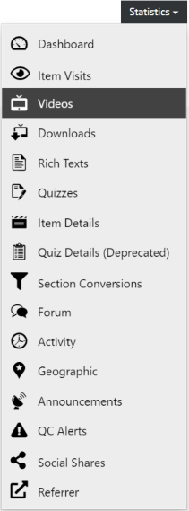
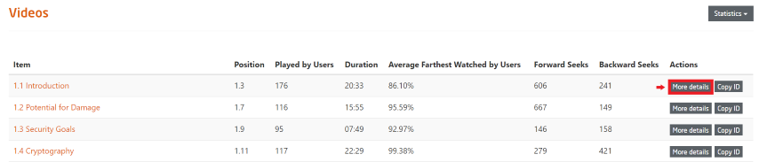
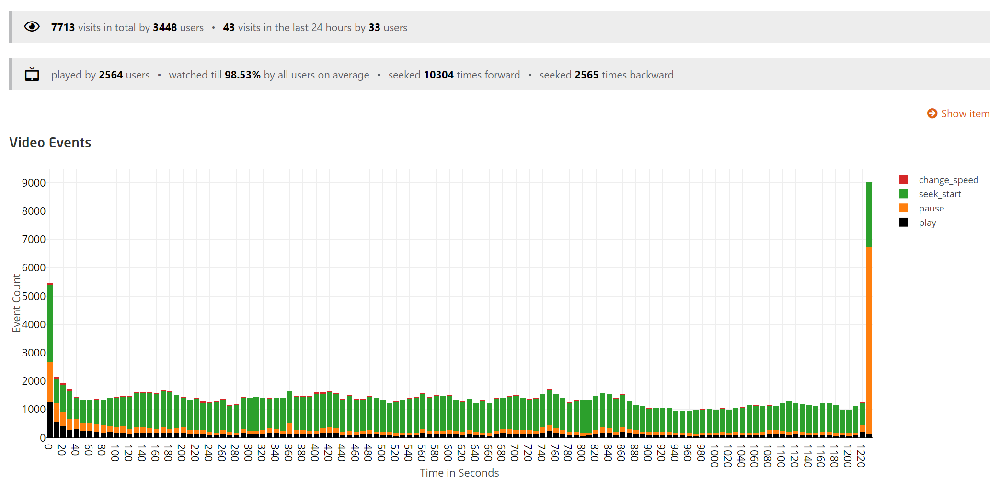

# Videos

  
*Fig. Navigate the Dashboard button from the drop-down list under the Course Administration button*  

  
*Fig. Find the Statistics button on the right hand side of the page*

  
*Fig. Navigate the Videos section from the drop-down list under the Statistics button*  

This page lists the statistical details of all the video items of a particular course.  
To further explain the statistics, the following headings are used as mentioned in the image below:

* **Item**	- Lists all the video items of the specific course
* **Position**	- Shows the position of the video item in the course structure according to the scheme [`Section_Number.Item_Number`]. For example, Position 1.3 would mean that the video item will be found in the 1st section and chronologically placed in the 3rd position
* **Played by Users**	- Number of users who played the video item
* **Duration**	- Duration of the specific video item of that particular course
* **Average Farthest Watched by Users**	- Average percentage of the video duration watched by users
* **Forward Seeks**	- Number of times the video was fast-forwarded
* **Backward Seeks**	- Number of times the video was rewinded backward
* **Actions** - Available action buttons for the video items

  
*Fig. Sample preview of the statistical details of all the video items of a specific course*  

Upon clicking the **More Details** button under the Actions column of a specific video item, the following page would be displayed, as shown in the image below. 

  
*Fig. Sample preview of the statistical details upon clicking **More Details** under the Actions column of a particular video item in a specific course*  

The above figure illustrates the video item details based on the following parameters:

* Change Speed - Number of times the speed of the video was changed
* Seek Start - Number of times the video was played again from the beginning
* Pause - Number of times the video was paused
* Play - Number of times the video was played  

The above illustration can be used to analyse the video item based on the parameters.