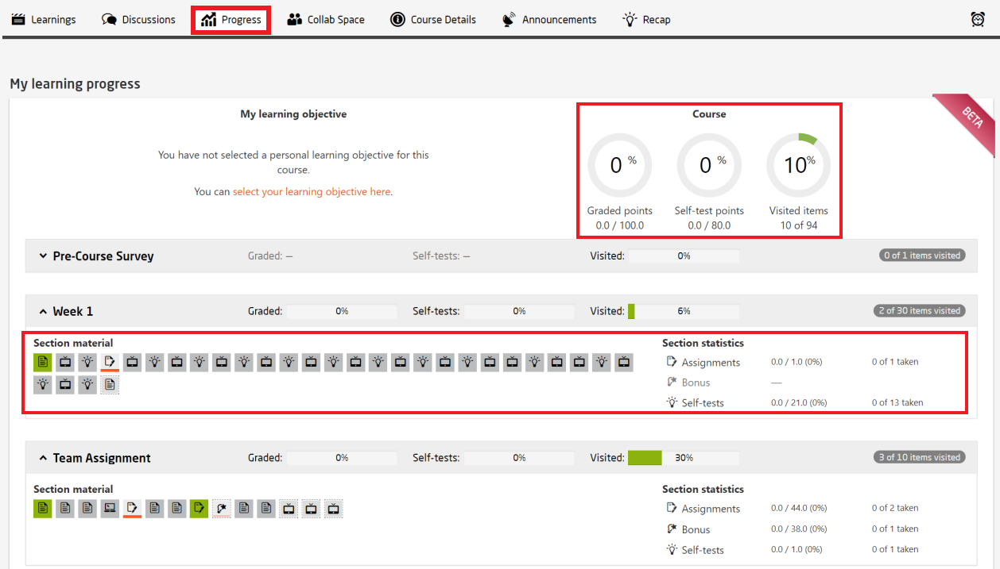
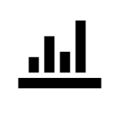
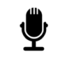

# Progress

During the course period, participants can view their learning progress with detailed visual information as shown in the illustration below:  

  
*Fig. Sample course progress page*  
   

To represent the learning items, openHPI uses the following icons:  

| Icons | Explanation |
|---|---|
|  | This item represents a text page |
|  | This item represents a video |
|  | This item represents a self-test quiz |
|  | This item can represent the main exam, an assignment or homework and peer-assessment |
|  | This item represents a survey |
|  | This item can represent a chart or statistical figure  |
|  | This item can represents an external quiz hosted on a different platform or external exercise tool |
|  | This item can represent a video conference or an assistant |
|  | This item represents a bonus quiz |
|  | This item represents a YouTube video |
|  | This item can represent an audio conference or a moderator |
|  | This item represents an external video  |  

The following legends represent the state of the icons:  

| Icons | State |
|---|---|
|  | This represents that the participant has not visited the item  |
|  | This represents that the participant has visited the item |