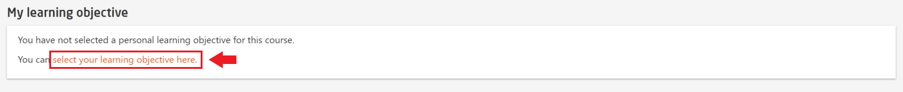
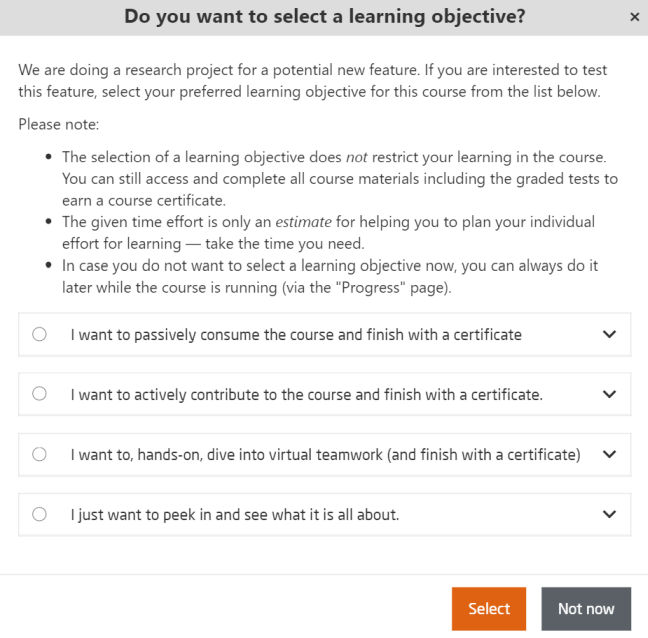
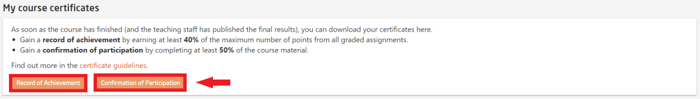

# Progress

During the course period, participants can view their learning progress with detailed visual information as shown in the illustration below:  

  
*Fig. Sample learning progress page*  
   

openHPI team added a new experimental feature called **Learning Objective**. For more details, please visit [Learning Objective](https://teachingteamguidelines.readthedocs.io/#features/learningobjectives/)  

It can be used to plan course participant's individual effort for learning and progressing through the course.  

  
*Fig. You can select your learning objective by clicking the highlighted link*  

  
*Fig. Learning objectives available for participants*  
 
At the bottom of the page, participants can download their respective certificates if they fulfil the required criterion.  

  
*Fig. Download buttons for respective certificates*