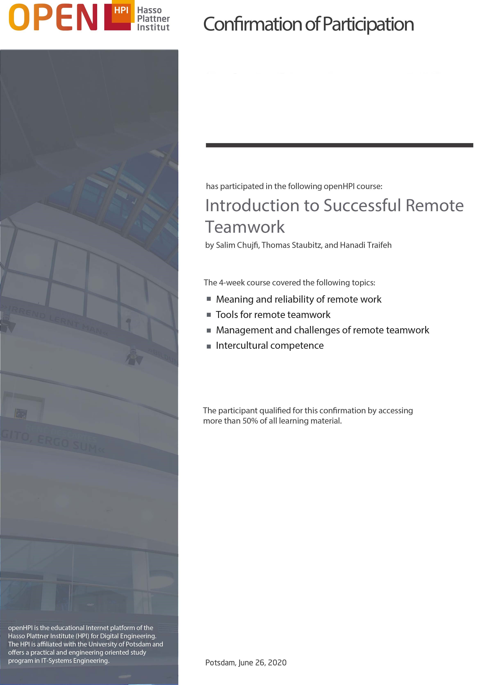
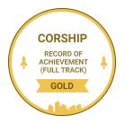

# Certificates

----------

For participation and successful completion of a course, participants receive a record of achievement. Three different types of performance records are offered at the HPI platform:

- **Confirmation of Participation (CoP)**  
Earned by participants who have been involved with at least 50% of the course material.  
The required percentage is configurable on a per course basis. We recommend, however, to define a general scheme how this has to be handled for all courses on a platform instance.
The CoP contains the following information:  Name of participant, date of birth (optional), course title and summary.

*Sample Confirmation of Participation*

- **Record of Achievement (RoA)**  
Given to those who have earned at least 50% of the points in the course. Points are available for the weekly assignments and the final exam.
The required percentage is configurable on a per course basis. We recommend, however, to define a general scheme how this has to be handled for all courses on a platform instance.
The Record of Achievement contains the following information:

  - Participant's name
  - Date of birth (optional)
  - Course title and summary
  - Credits earned
  - Course performance (if you're among the top 5%, 10%, or 20% of participants)
  - Anti-counterfeit link and QR code

- **Qualified Certificate**  
These can be booked by participants. Through automatic face recognition, verification is carried of the participant as the actual test subject. HPI grants participants ECTS (European Credit Transfer System) credits for the Qualified Certificate and encourages the acceptance of these credits by other institutions.
This feature currently is only available on the openHPI platform. If you're interested in including the feature on your platform instance, please contact us: openhpi-info@hpi.de

Certificate settings can be flexibly configured on the platform. Course providers are able to decide what type of certificate they wish to award and what criteria needs to be met.
We recommend, however, to define a general scheme how this has to be handled for all courses on a platform instance.

Records of Achievement and Qualified Certificates, furthermore, feature a verification URL and a QR code that allows e.g. employers to check if the certificate has been tampered with. 
 
- **Open Badges**  
If you’ve earned a Record of Achievement, then your open badge comes along with it and can be found on your certificates page. You can download the badge to your computer and upload it to a badge backpack of your choice, such as badgr or Open Badge Passport. You can easily share it via social media or email. When you share your badge, the badge includes a verification link which your followers can access. Once they click this link, they will arrive at your verification page. This page will include your user information, with your name, the date of issue of the badge, and your results. 

  
  *Sample Badge*

