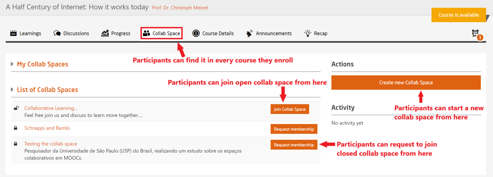

# Collab Spaces

Every course participant can create collab spaces.
The participant who has created the collab space is automatically the administrator of this collab space.
Collab space administrators can provide other collab space members with collab space administration permissions. 

Collab spaces offer the following benefits:  

* Smaller groups within a course 
* Possibility to collaborate, such as file sharing, collaborative text editing and video conferencing. 

Collab spaces can either be open or closed.
All course participants can join open collab spaces without further ado.

For closed collab spaces
* participants need to first apply for membership to gain entry 
* request for membership must be confirmed by the **creator/administrator** of the collab space before admission into the group  

  
*Preview of a sample Collab Space in a course*  

Collab spaces provide a whole range of communication and collaboration tools:   

* Private discussion forum (accessible only by collab space members and the teaching team)
* Video conference tool (Jitsi)
* Collaborative text editing (Etherpad) 
* File Sharing 
* Calendar

Besides the participant-initiated groups that have been described above, the teaching team also has an option to create teams and to provide these teams with tasks that have to be completed collaboratively. The teams submissions can then be graded via the platforms peer assessment system.
